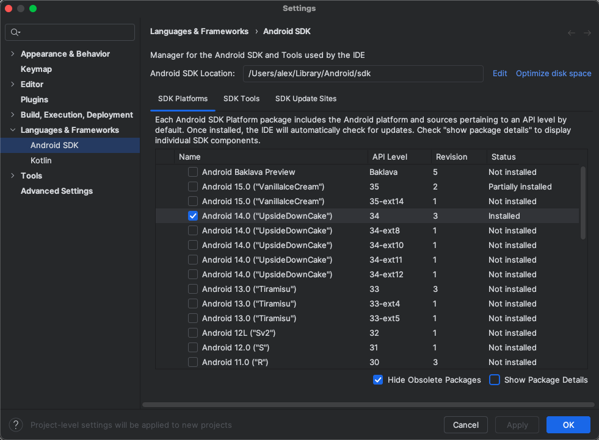

# Aula 01 - Introdução

## Plano de ensino e avaliação

Consultar moodle da disciplina (<https://www.tads.ufpr.br>).

## O que aprenderemos?

Como desenvolver aplicativos nativos para Android utilizando Kotlin e Android Studio.

## Como aprenderemos?

Por meio de aulas teóricas e práticas. Toda aula marcada com "P" no plano de
ensino indica uma aula prática que será composta por um exercício a ser entregue
ao professor na própria aula.

Todas as entregas de exercícios serão feitas pelo moodle e utilizando links de repositórios
criados pelos alunos no gitlab do curso (gitlab.com).

## Essa disciplina é difícil?

Não. Porém o bom aproveitamento depende de muita prática. O aprendizado do
desenvolvimento de aplicativos para Android envolve, entre outras coisas,
o estudo (e o uso) de vários exemplos de código prontos.
Isso facilita o processo de desenvolvimento, uma vez
que boa parte do trabalho acaba se tornando a ligação de pedaços de código
já funcionais (montando lego =P). Mas, após um certo amadurecimento do
conhecimento é necessário que a compreensão de como esses trechos de códigos são
formados seja expandida.

Portanto, é necessário praticar para que os exemplos sejam apreendidos e
aprendidos de forma adequada. Não se assuste com a quantidade de códigos novos
no início da disciplina. A ideia é que eles se tornem, pouco a pouco, mais
"palatáveis"[.](http://www.quickmeme.com/img/60/6091f3946fbb257fc235f10bd1911a15f1037ce6c14cdede25c8277aa5e5a467.jpg)
Além disso, utilizaremos uma linguagem nova - o [Kotlin](https://www.freecodecamp.org/news/content/images/2019/07/meme.jpeg)[.](https://me.me/i/google-kotlin-java-java-no-you-didn%E2%80%99t-1c90464fb0e14f0b84e9adf63ad468e1)

## Android

- Sistema Operacional para dispositivos móveis mais utilizado em todo o mundo:
  - Mais de 2bi de dispositivos ativos;
- Além do sistema operacional, inclui:
  - Middleware (comunicação entre aplicativos);
  - Aplicações-chave;
- Kernel do Linux como base;
- Open-source ( <http://source.android.com> ):
  - Licença Apache;
  - Cada fabricante pode criar seu Android "personalizado";
  - Entretanto, para ter Apps do Google, o sistema deve ser homologado;
- Primeira versão lançada em 2008;
- **API Level** é um número sequencial que identifica a versão do Android
  (também possui o nome de um doce);
- Estamos indo para a API Level 30, versão 11:
  - Para saber mais: <https://en.wikipedia.org/wiki/Android_version_history>
- É importante conhecer as versões do Android para sabermos quais as APIs,
  classes e recursos estão disponíveis para nossos aplicativos em certos
  aparelhos;

## Android Studio

- O Android Studio é o IDE (Integrated Development Environment) padrão para
  desenvolvimento de aplicações Android;
- Uma personalização do IntelliJ IDEA Community, criado pela Jetbrains;
- Traz MUITAS ferramentas para auxiliar no processo de desenvolvimento;

### Download

- Todos deverão ter instalado em seus computadores (ou utilizar o lab);
- Para isso, basta fazer o download do pacote específico para o seu sistema
  operacional:

<https://developer.android.com/studio/>

- Em geral, utilizaremos a versão 3.6;
- O pacote baixado já traz todas as dependências necessárias:
  - OpenJDK;
  - Gradle;
  - Android Debug Bridge (adb);
  - SDK Manager;
- Após instalado, ao iniciar o Android Studio, provavelmente a seguinte tela
  aparecerá:

- A partir dessa tela, é possível acessar o SDK Manager (Configure -> SDK
  Manager);
- Nele, é possível baixar e instalar componentes do SDK:
  - Na aba **SDK Platforms**, clique em **Show Package Details**;
  - Marque, pelo menos, os seguintes itens:
    - Android 9.0 (Pie):
      - Android SDK Platform 28;
      - Sources for Android 28;
      - Google Play Intel x86 Atom System Image;
  - Na aba **SDK Tools** adicione, ao menos, os itens:
    - Android SDK Build-Tools;
    - Android Emulator;
    - Android SDK Platform-Tools;
    - Android SDK Tools;
    - Documentation for Android SDK;
  - Por fim, clique em **Apply** para finalizar;
  - Aguarde o download e a instalação.

## Kotlin

- <https://kotlinlang.org/>
- Kotlin é uma Linguagem de programação que roda em uma Máquina virtual Java e
  que também pode ser traduzida para JavaScript;
- É a linguagem oficial para o desenvolvimento de aplicativos para Android;
- Tem interoperabilidade completa com Java;
- Aprenderemos no decorrer da disciplina:
  - Mas, para iniciarmos, assista as aulas do curso da Udemy (feito pelo Google)
    até, pelo menos, o tópico de **Funções**:
    - <https://www.udacity.com/course/kotlin-bootcamp-for-programmers--ud9011>
    - Possui legendas em português.

## Mais recursos

- Developer Guides Official: <https://developer.android.com/guide>
- [Sobre o Android](aula_01_historico_android.pdf) - Slides de uma disciplina antiga (Prototipação de Aplicativos Móveis).

# Referências

- Glauber, Nelson, Dominando o Android com Kotlin, São Paulo : Novatec, 2019, 3ed.
