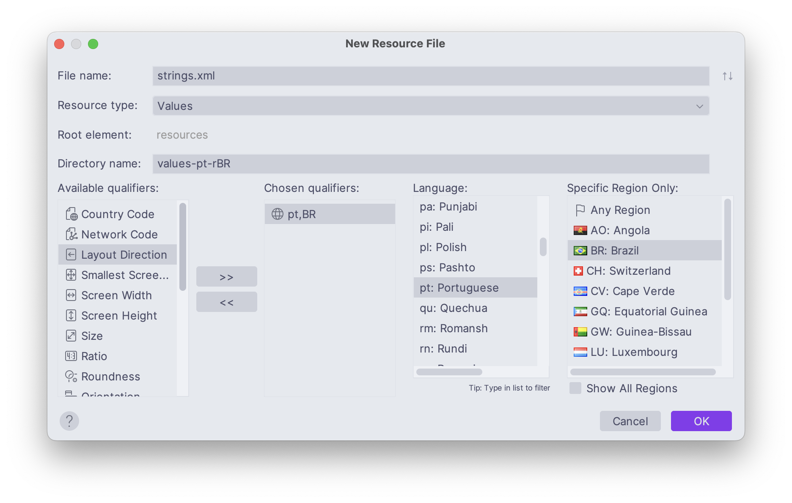
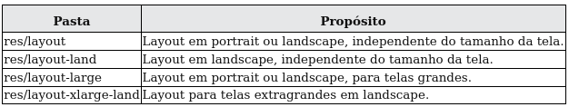
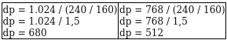

# Aula 02 - Conceitos Básicos

A aula tem como objetivo criar um primeiro aplicativo Android e analisar sua
estrutura principal.

## Iniciando um novo projeto com [Android Studio](./res/images/aula_02/99_meme_vim.jpg)

- Para criar um novo aplicativo no Android Studio:

  - Em sua tela inicial, selecione a opção **Start a new Android Studio
    project** ou **File > New > New Project**;

    

  - A tela acima permite a escolha de um template para a **Activity**:
    - **Activity** é a classe responsável por criar uma tela na aplicação Android;
    - A activity inicial de uma aplicação é comumente nomeada **MainActivity**;
    - Toda activity tem seu conteúdo visual definido em arquivos XML, conhecidos como "Arquivos de layout";;
  - Selecione a opção **Empty Activity** para um primeiro exemplo;

    

  - Na sequência é necessário acrescentar as primeiras configurações da aplicação. São elas:
    - **Name**: nome que aparecerá no aparelho;
    - **Package Name**: nome do pacote. Este nome deve ser único!
    - **Save location**: onde o projeto será salvo no computador;
    - **Minimum API Level**: qual a versão mínima do Android que o aparelho deve possuir para executar a aplicação. Procuraremos sempre utilizar, no mínimo, a API Level 24 (Android Nougat);
    - **Build configuration language**: define scripts de build padrão para Kotlin;

- Após criar o novo projeto, o Android Studio irá realizar verificações de dependências necessárias para realização do build do projeto. [Espere pacientemente](./res/images/aula_02/99_meme_gradle.jpg). Isso pode envolver alguns downloads:

  - Além disso, ele pode iniciar o processo de "Indexing";
  - Esse processo é o reconhecimento dos arquivos do projeto para que o Android Studio consiga executar todas as suas funcionalidades;
  - Novamente, aguarde pacientemente. :)

    [^1]

## Android Jetpack

- O **Android Jetpack** é uma coleção de bibliotecas para facilitar o desenvolvimento de aplicativos Android;
- Auxilia no uso das práticas recomendadas de desenvolvimento;
- Simplifica tarefas complexas;
- Tem desenvolvimento separado da API Level:
  - Significa que tem updates mais frequentes;
  - Não é necessário aguardar uma nova versão do Android para acessar novas funcionalidades;
- Antes do Jetpack, não havia padrão para os nomes de bibliotecas oficiais do Android:
  - `android.arch.*`, `com.android.support.*`, `android.databinding.*` ...;
  - Com o Jetpack, todas as bibliotecas estão no pacote `androidx.*`;
  - Como esse é um processo em transição, ainda existem vários projetos de aplicativos que utilizam as bibliotecas antigas;
  - O objetivo é que todos migrem para o Jetpack:
    - O próprio Android Studio possui uma opção para migrar projetos para o Jetpack (**Refactor > Migrate to Android X**);
- Recentemente o **Jetpack Compose** foi lançado[^2]:
  - Forma mais simples de gerar layouts para aplicações;
  - Substitui os arquivos ~~horríveis~~ de layout XML;
- Mais informações: <https://developer.android.com/jetpack/>

## Estrutura de um projeto Android

- No canto superior esquerdo do Android Studio é possível selecionar diferentes visualizações da estrutura do projeto;
- Selecione o tipo **Project**;
- Você verá uma organização semelhante a essa:

  

- Analisaremos detalhes dessa estrutura a seguir.

### AndroidManifest.xml

- O arquivo **AndroidManifest.xml** serve como um arquivo central de configuração do aplicativo;
- Os dados utilizados na tela de configuração do aplicativo estão aqui:

```xml
<?xml version="1.0" encoding="utf-8"?>
<manifest xmlns:android="http://schemas.android.com/apk/res/android"
    xmlns:tools="http://schemas.android.com/tools">

    <application
        android:allowBackup="true"
        android:dataExtractionRules="@xml/data_extraction_rules"
        android:fullBackupContent="@xml/backup_rules"
        android:icon="@mipmap/ic_launcher"
        android:label="@string/app_name"
        android:roundIcon="@mipmap/ic_launcher_round"
        android:supportsRtl="true"
        android:theme="@style/Theme.HelloWorldTADS"
        tools:targetApi="31">
        <activity
            android:name=".MainActivity"
            android:exported="true"
            android:label="@string/app_name"
            android:theme="@style/Theme.HelloWorldTADS">
            <intent-filter>
                <action android:name="android.intent.action.MAIN" />

                <category android:name="android.intent.category.LAUNCHER" />
            </intent-filter>
        </activity>
    </application>

</manifest>
```

- Todas as activities que serão exibidas para os usuários deverão estar declaradas no **AndroidManifest.xml**;
- Note que a **action** `android.intent.action.MAIN` indica qual activity é o ponto de entrada da aplicação:
  - Ou seja, qual activity vai ser iniciada quando o usuário abrir o aplicativo;
- A **category** `android.intent.category.LAUNCHER` indica que essa activity deverá aparecer no menu de aplicações do aparelho.
- Valores que possuem o símbolo "@" indicam um recurso da aplicação.

### Arquivos de Recursos

- Os recursos da aplicação são imagens, textos, layouts, e outros itens a serem utilizados pelo desenvolvedor;
- Todos eles ficam localizados em `app/src/main/res`;
- Para cada recurso, um identificador é mapeado automaticamente;
- Esse identificador fica armazenado na classe `R`;
- Por exemplo:

  - Na pasta `res/mipmap-mdpi`, existe um arquivo chamado `ic_launcher.webp`;
  - É possível acessar esse arquivo pelo identificado `R.mipmap.ic_launcher` em qualquer código Kotlin da aplicação:
    - Nos arquivos xml, ao invés de utilizarmos a classe R, utilizamos o sinal `@` para referenciarmos algum recurso;
  - Vejamos mais uma vez um trecho do _AndroidManifest.xml_:

  ```xml
          android:label="@string/app_name"
  ```

  - Na definição acima, a propriedade `android:label` está utilizando como valor o recurso `@string/app_name`. Ou seja, o arquivo `res/values/strings.xml` será consultado;
  - Dentro desse arquivo, a string nomeada `app_name` trará o valor do recurso;
  - Ao consultar o arquivo `res/values/strings.xml` temos:

  ```xml
  <resources>
    <string name="app_name">Hello World TADS</string>
  </resources>
  ```

  - Em resumo, para acessar o valor da string `app_name`:
    - No kotlin: `getString(R.string.app_name)`;
    - No xml: `@string/app_name`;
  - Alguns mapeamentos de recursos comuns são mostrados a seguir:

| Recurso | ID da Classe R | Arquivo XML |
| ------------- | -------------- | -------------- |
| res/mipmap/ic launcher.png | IR.mipmap.ic_launcher | @mipmap/ic_launchertem1 |
|res/drawable/imagem.png | R.drawable.imagem | @drawable/imagem|
|res/layout/activity_main.xml | R.layout.activity_main | @layout/activity main|
|res/menu/menu_main.xml | R.menu.menu main | @menu/menu_main|
|res/values/strings.xml  `<string name="ola">` | R.string.ola | @string/ola|

- O sistema de identificação dos recursos na aplicação é mais esperto do que parece. Mais a frente veremos alguns detalhes interessantes.

### MainActivity.kt

- Nosso primeiro código kotlin:

```kotlin
package com.example.helloworldtads

import android.os.Bundle
import androidx.activity.ComponentActivity
import androidx.activity.compose.setContent
import androidx.activity.enableEdgeToEdge
import androidx.compose.foundation.layout.fillMaxSize
import androidx.compose.foundation.layout.padding
import androidx.compose.material3.Scaffold
import androidx.compose.material3.Text
import androidx.compose.runtime.Composable
import androidx.compose.ui.Modifier
import androidx.compose.ui.tooling.preview.Preview
import com.example.helloworldtads.ui.theme.HelloWorldTADSTheme

class MainActivity : ComponentActivity() {
    override fun onCreate(savedInstanceState: Bundle?) {
        super.onCreate(savedInstanceState)
        enableEdgeToEdge()
        setContent {
            HelloWorldTADSTheme {
                Scaffold(modifier = Modifier.fillMaxSize()) { innerPadding ->
                    Greeting(
                        name = "Android",
                        modifier = Modifier.padding(innerPadding)
                    )
                }
            }
        }
    }
}

@Composable
fun Greeting(name: String, modifier: Modifier = Modifier) {
    Text(
        text = "Hello $name!",
        modifier = modifier
    )
}

@Preview(showBackground = true)
@Composable
fun GreetingPreview() {
    HelloWorldTADSTheme {
        Greeting("Android")
    }
}
```

- Diferenças claras com relação ao Java:

  - Extensão do arquivo (.kt);
  - Sem `;` no final do comandos (é opcional);
  - Operador de herança: `:`:
    - Classe `MainActivity` está herdando `ComponentActivity`;
  - Toda classe herda de `Any` e não de `Object`;
  - Ao sobreescrever um método, é necessário utilizar a palavra-chave `override`;
  - Toda função (ou método) tem a seguinte sintaxe:
    - `<modificador> fun nomeDaFuncao(<parametros>) : <tipo de retorno>`:

      ```kotlin
      private fun soma(a:Int, b:Int): Int {
        return a + b
      }
      ```

  - Não existem tipos primitivos. Todos são classes;
  - Possui o recurso de **nulabilidade** (_nullability_):
    - É obrigatório declarar se um atributo, variável ou parâmetro pode ser nulo ou não;
    - Se sim, adiciona-se um `?` ao tipo do item. Ex.: `Int?`;
    - Outros exemplos:

      ```kotlin
      var a:String = "Kotlin"
      a = null // não compila! "a" não aceita nulo
      var b:String? = "abc"
      b = null // ok
      val lenA = a.length // ok! é garantido que "a" não é nulo
      val lenB = b.length // não compila, pois "b" pode ser nulo
      val lenB1 = if (b != null) b.length else -1
      val lenB2 = b?.length ?: -1 // "Elvis operator"
      ```

    - `var` indica variável, enquanto `val` indica constante;
    - Possuí inferência automática de tipos;
    - Estrutura if/else sempre retorna um valor;
    - O _Elvis Operator_ (`?:`) serve para verificar se determinada expressão é nula e, caso positivo, retorna um valor não nulo.

- Sobre o código da **MainActivity**:
  - O método `onCreate(Bundle)` é chamado quando a Activity é criada e nele é chamado o método `setContent` para informar qual é o componente a ser desenhado na tela;

### Arquivo de Layout (como _era_ com arquivos XML)

- Os arquivos de layout são arquivos XML que definem a estrutura visual de uma ou mais activities;
- Localizam-se na pasta `res/layout`;
- Na MainActivity, utilizamos a classe `R` para referenciar um layout (`R.layout.activity_main`;
- Ao abrir o arquivo de layout correspondente, temos acesso ao editor de layouts:

  - Este pode ser utilizado com a interface gráfica (Design) ou de texto;

    

  - O layout da nossa MainActivity possui o seguinte conteúdo xml:

    ```xml
    <?xml version="1.0" encoding="utf-8"?>
    <androidx.constraintlayout.widget.ConstraintLayout xmlns:android="http://schemas.android.com/apk/res/android"
        xmlns:app="http://schemas.android.com/apk/res-auto"
        xmlns:tools="http://schemas.android.com/tools"
        android:layout_width="match_parent"
        android:layout_height="match_parent"
        tools:context=".MainActivity">

        <TextView
            android:layout_width="wrap_content"
            android:layout_height="wrap_content"
            android:text="Hello World!"
            app:layout_constraintBottom_toBottomOf="parent"
            app:layout_constraintLeft_toLeftOf="parent"
            app:layout_constraintRight_toRightOf="parent"
            app:layout_constraintTop_toTopOf="parent" />

    </androidx.constraintlayout.widget.ConstraintLayout>
    ```

  - Na próxima aula teremos mais detalhes de como os layouts funcionam;
  - Entretanto, já é possível observar pelo arquivo acima que nosso layout é composto por:
    - Um gerenciador de layout conhecido por `ConstraintLayout`;
    - Um `<TextView>` com conteúdo "Hello World!" e algumas indicações de posicionamento;

## Configuração do Aparelho

- Para executar nossa aplicação em um aparelho real é necessário, primeiramente, configurar o aparelho:

  1. Acesse o menu **Sobre o telefone** nas configurações do aparelho (provavelmente no menu **Sistema**);
  2. Toque **7 vezes** no item **Número da Versão** (ou **Build Number** ou qualquer outro nome parecido com isso);
  3. Você verá o aviso "Você agora é um desenvolvedor";
  4. Isso habilitará o menu **Opções de desenvolvedor** nas configurações do aparelho;
  5. Nesse menu, ative a opção **Depuração USB (USB Debugging)**;
  6. Agora ao conectar o aparelho ao computador com um cabo USB, o Android Studio será capaz de reconhecê-lo:

     1. Pode ser que uma mensagem de confirmação apareça no aparelho. Apenas confirme;
     2. Normalmente, em dispositivos Unix, o aparelho é reconhecido automaticamente. No windows, às vezes, é necessário baixar o driver do aparelho no site do fabricante.
     
     

     

## Android Virtual Device

- Um Android Virtual Device (AVD) é um emulador do Android;
- Pode-se utilizar um AVD para testar aplicativos do Android Studio sem a necessidade de um aparelho real;
- Uma das vantagens do AVD é a possibilidade de testar o aplicativo em diferentes tipos de dispositivos (tamanho de tela, resolução, recursos, etc);
- Para computadores com processador Intel é possível instalar o HAXM (Hardware Accelerated Execution Manager):
  - Nos casos em que há compatibilidade, o Android Studio já instala esse recurso automaticamente;
- Para criar um AVD, basta acessar o menu **Tools > AVD Manager** ou **Tools > Device Manager** no Android Studio e seguir as instruções;
- Em um dado momento da configuração, será necessário selecionar uma imagem de sistema. Ou seja, qual a versão do Android que o emulador irá utilizar:
  - Nesse momento, o download da imagem deverá ser realizado.
- Existem outros emuladores de Android que não são oficiais da empresa Google.

## Executando a Aplicação

- Uma vez você tenha um celular conectado ao seu computador pela porta USB ou um AVD pronto, o Android Studio irá reconhecer esse aparelho como um alvo para execução da sua aplicação:

  

- Nesse momento, basta clicar no botão **Run app** (botão verde em formato de _play_);
- Ao fazer isso, sua aplicação será compilada e instalada no dispositivo, e inicializada automaticamente:

  

## Processo de Compilação

- O Android Studio utiliza o _Gradle_ (<https://www.gradle.org>) como ferramenta para gerenciamento do build dos aplicativos;
- Essa ferramenta é responsável por toda a configuração e inclusão/download de dependências para o processo de compilação do aplicativo;
- O Gradle é uma aplicação completa, independente do Android Studio:
  - Sua interface mais comumente utilizada é pela linha de comando;
  - Também é bastante utilizado em projetos de outras linguagens;
- Em um projeto, o arquivo principal para o Gradle é nomeado `build.gradle`;
- Nos projetos do Android Studio, existem, pelo menos, dois arquivos com esse nome: um na raiz do projeto e outro em cada módulo (o módulo que vamos ver nesse curso trata do aplicativo smartphone e tablets, comumente nomeado de **app**);
- O arquivo `build.gradle` do nosso módulo app contém algo semelhante a isso:

```gradle
plugins {
    alias(libs.plugins.android.application)
    alias(libs.plugins.kotlin.android)
    alias(libs.plugins.kotlin.compose)
}

android {
    namespace = "com.example.helloworldtads"
    compileSdk = 35

    defaultConfig {
        applicationId = "com.example.helloworldtads"
        minSdk = 24
        targetSdk = 35
        versionCode = 1
        versionName = "1.0"

        testInstrumentationRunner = "androidx.test.runner.AndroidJUnitRunner"
    }

    buildTypes {
        release {
            isMinifyEnabled = false
            proguardFiles(
                getDefaultProguardFile("proguard-android-optimize.txt"),
                "proguard-rules.pro"
            )
        }
    }
    compileOptions {
        sourceCompatibility = JavaVersion.VERSION_11
        targetCompatibility = JavaVersion.VERSION_11
    }
    kotlinOptions {
        jvmTarget = "11"
    }
    buildFeatures {
        compose = true
    }
}

dependencies {

    implementation(libs.androidx.core.ktx)
    implementation(libs.androidx.lifecycle.runtime.ktx)
    implementation(libs.androidx.activity.compose)
    implementation(platform(libs.androidx.compose.bom))
    implementation(libs.androidx.ui)
    implementation(libs.androidx.ui.graphics)
    implementation(libs.androidx.ui.tooling.preview)
    implementation(libs.androidx.material3)
    testImplementation(libs.junit)
    androidTestImplementation(libs.androidx.junit)
    androidTestImplementation(libs.androidx.espresso.core)
    androidTestImplementation(platform(libs.androidx.compose.bom))
    androidTestImplementation(libs.androidx.ui.test.junit4)
    debugImplementation(libs.androidx.ui.tooling)
    debugImplementation(libs.androidx.ui.test.manifest)
}
```

- O Gradle funciona essencialmente a base de plugins;
- Na 3 primeiras linhas do arquivo acima, são invocados 3 plugins do gradle: uma para desenvolvimento para android e dois referentes ao uso do kotlin;
- Esses plugins possuem as informações necessárias para que a compilação seja adequada às necessidades do projeto (Android + Kotlin);
- No bloco `android` residem as configurações específicas para o plugin android;
- Ao final do arquivo, o bloco `dependencies` define as dependências de bibliotecas externas ou módulos necessários pelo projeto:
  - Cada dependência pode ter a versão específica no final de sua linha;
- O arquivo `build.gradle` da raiz do projeto possui definições que serão utilizadas em todos os módulos:

```gradle
// Top-level build file where you can add configuration options common to all sub-projects/modules.
plugins {
    alias(libs.plugins.android.application) apply false
    alias(libs.plugins.kotlin.android) apply false
    alias(libs.plugins.kotlin.compose) apply false
}
```

- No decorrer das aulas trataremos de mais detalhes sobre o Gradle.

## Alocação dinâmica de recursos

- Todos os recursos de uma aplicação (strings, imagens, estilos, layouts, etc.) devem, obrigatoriamente, estar na pasta `res/`;
- Cada subdiretório dessa pasta tem, entretanto, objetivos específicos. Os principais são:
  - **anim/** e **animator/**: arquivos XML de animações quadro-a-quadro ou de efeito;
  - **drawable/**: arquivos de imagens da aplicação _.jpg ou_.png, ou ainda arquivos XML que descrevem algo que será desenhado na tela;
  - **font/**: arquivos de fontes _.ttf ou_.otf, ou arquivos XML que descrevem famílias de fontes;
  - **layout/**: arquivos XML com a definição do conteúdo visual das telas;
  - **menu/**: arquivos XML com as opções de menu;
  - **mipmap/**: ícone da aplicação;
  - **raw/**: arquivos binários diversos que podem ser usados no projeto;
  - **transition/** arquivos XML para descrever animações de transição;
  - **values/**: arquivos XML com valores tais como: strings (texto simples); string_arrays (lista de valores), dimensions (definição de tamanhos); colors (definição de cores) e styles (estilos);
  - **xml/**: essa pasta normalmente armazena arquivos XML de metadados da aplicação;
- Todos os arquivos de recursos devem ser nomeados com letras minúsculas e não devem conter símbolos (exceto `_`):
  - A partir do segundo caractere podem conter números;
- A extensão do arquivo não é utilizada para a geração do id da classe R, portanto não é possível ter um mesmo arquivo com duas extensões diferentes;

- O Android possui um recurso de escolha dinâmica de recursos (ou alocação dinâmica) em que o sistema operacional seleciona o recurso mais apropriado de acordo com as configurações do aparelho:

  - Para isso, é preciso apenas criar variações nos diretórios de recursos adicionando **sufixos** especiais aos seus nomes:

    

- É possível combinarmos sufixos. Por exemplo:
  - `layout-pr-rBR-large`: layouts a serem utilizados em aparelhos configurados em português brasileiro e com uma tela grande;
  - `values-mcc724-mnc31-v21`: valores a serem utilizados em aparelhos no Brasil, da operadora Oi e com API level 21;
  - `drawable-land-hdpi`: desenhos a serem utilizados em aparelhos em posição horizontal e com uma densidade de tela de 240dpi;
- Além disso o Android tentará, na ausência de uma pasta específica, fazer a melhor aproximação possível do recurso a ser utilizado.

### Idioma

- Como exemplo, podemos realizar um processo de internacionalização do nosso aplicativo inicial;
- Abra o arquivo `res/values/strings.xml` e adicione o seguinte:

  ```xml
  <resources>
      <string name="app_name">Hello World TADS</string>
      <string name="test">This is a test</string>
  </resources>
  ```

- Agora, no arquivo `MainActivity.kt` referencie essa string:

```kotlin
Greeting(
    name = getString(R.string.test), // ⬅️ Altere aqui
    modifier = Modifier.padding(innerPadding)
)
```

- É recomendado que todo texto utilizado em um aplicativo esteja registrado apenas em arquivos de recursos;
- Agora clique sobre a pasta `app/src/main/res` e escolha a opção **New > Android Resource File**:
- Adicione o nome `strings.xml` e selecione opção **Locale** e clique no botão **>>**;
- Selecione português e clique em **OK**;
  
  

- Agora adicione o seguinte conteúdo ao arquivo criado:

```xml
<?xml version="1.0" encoding="utf-8"?>
<resources>
    <string name="app_name">Olá Mundo TADS</string>
    <string name="test">Isso é um Teste</string>
</resources>
```

- Compile e execute o aplicativo;
- Altere a configuração de Idioma do seu aparelho e veja que a aplicação se adapta de maneira automática.

  

## DPI, Orientação e DIP

- O Android possui uma especificação própria no que diz respeito ao tamanho e qualidade de tela de um dispositivo;
- Um dos itens para definir a qualidade de uma tela é a unidade _Dots per Inch_ (Pontos por polegadas) ou **DPI**:
  - O Android classifica os dispositivos em categorias de acordo com a quantidade de DPI existente. São elas:

    

- Dessa forma, é possível adicionar imagens de diferentes tamanhos (em diferentes pastas de recursos) para que sejam selecionadas as melhores adaptadas à qualidade de tela do dispositivo;
- É possível, também, definir recursos de acordo com a orientação atual da tela do dispositivo (horizontal ou vertical):
  - A tabela a seguir apresenta exemplos de recursos utilizados em diferentes orientações de tela:

    

- Para determinarmos se uma tela é pequena ou grande, temos a seguinte lista de categorias:

  

- Perceba que a unidade agora é **DP** (ou **DIP** - \*Density Independent Pixels):
  - Essa é uma unidade que leva em consideração a quantidade de pixels na tela em sua área física;
  - Ou seja, quanto mais pixels tivermos por área, melhor será a qualidade da tela;
  - O DIP de uma tela é calculado da seguinte maneira:

    ```
    dp = pixels / (dpi / 160)
    ```

  - Por exemplo, qual o tamanho da tela (para o Android) de um aparelho com resolução de 1024x768 pixels com densidade 240dpi (HDPI)?

    

  - Logo a tela irá se enquadrar na categoria _large_, pois tem 680x512dp;
  - A unidade DP é mais precisa para medir a qualidade das telas;
  - Para saber mais informações sobre seu dispositivo, adicione o seguinte código no método `onCreate(Bundle)` da MainActivity:

    ```kotlin
    val config = resources.configuration
    val metrics = resources.displayMetrics
    val orientation = config.orientation
    val density = metrics.density
    val height = metrics.heightPixels
    val width = metrics.widthPixels
    val mcc = config.mcc
    val mnc = config.mnc
    val locale = if (Build.VERSION.SDK_INT >= Build.VERSION_CODES.N)
        config.locales[0] else config.locale

    val tag = "DS151"
    Log.d(tag, "density: $density")
    Log.d(tag, "orientation: $orientation")
    Log.d(tag, "height: $height")
    Log.d(tag, "width: $width")
    Log.d(tag, "language: ${locale.language} - ${locale.country}")
    Log.d(tag, "mcc: $mcc")
    Log.d(tag, "mnc: $mnc")
    ```

  - Para compilar o código sem erros, será necessário adicionar as dependências `android.util.Log` e `android.util.log` ao código:

    ```kotlin
    import android.util.Log
    import android.os.Build
    ```

  - Se preferir, pressione o atalho **ALT+Enter** para que o Android Studio sugira a importação:
    - Ou ainda, nas configurações do Android Studio, habilite a auto importação;
  - Agora, após executar a aplicação, consulte o menu **View > Tool Windows > Logcat** para verificar a saída do Log.

## Jetpack Compose

- Nova forma de produzir layouts de aplicações no Android Nativo;
  - Substitui os antigos arquivos XML de views;
  - É a forma padrão e indicada para a criação de novos layouts;
- Traz muitas das ideias dos frameworks React Native e Flutter para o Android Nativo;

  - O que torna a ideia muito interessante, unindo o melhor dos dois mundos;

- Sistema de componentes de interface;
  - Cada componente da interface será uma função do tipo _Composable_;
  - A intenção é que o desenvolvedor crie uma coleção de funções, ou seja, de componentes, para que sejam reutilizadas na aplicação ou, inclusive, em outros projetos;

### Funções Composable

- São funções Kotlin que possuem o modificador `@Composable`:

  - O modificador permite que a função tenha acesso a outras funções do pacote _Composable_.

- Tudo continua igual:
  - O arquivo `AndroidManifest.xml` indica qual _Activity_ é o _Entry Point_ da aplicação;
  - Essa _Activity_ determina o seu layout a partir da função `setContent`:
    - A diferença é que, ao invés de utilizar um arquivo XML de View, agora a função `setContent` recebe chamadas de funções _Composable_;

> [!Note]
>
> - Diferença entre componentes `Surface` e `Scaffold`:
>   - São estruturas fundamentais de layout. Algo como containers;
>   - Porém, `Scaffold` torna mais fácil o tratamento de área cobertas pelo Sistema Operacional (como barras de notificação, notch de câmera, botões de navegação, etc.);
>   - Isso é ainda mais importante após a decisão do Google de que as [aplicações devem usar `enableEdgeToEdge()`](https://developer.android.com/about/versions/15/behavior-changes-15#edge-to-edge).
>     - Isso significa que a aplicação é que deve tomar conta dessas áreas cobertas, ocupando a tela de "borda à borda";
>   - Com o `Surface` esse controle se torna bem mais complexo.

```Kotlin
class MainActivity : ComponentActivity() {
    override fun onCreate(savedInstanceState: Bundle?) {
        super.onCreate(savedInstanceState)
        enableEdgeToEdge()
        setContent {
            BasicsCodelabTheme {
                Scaffold( modifier = Modifier.fillMaxSize() ) { innerPadding ->
                    Greeting(
                        name = "Android",
                        modifier = Modifier.padding(innerPadding)
                    )
                }
            }
        }
    }
}

@Composable
fun Greeting(name: String, modifier: Modifier = Modifier) {
    Text(
        text = "Hello $name!",
        modifier = modifier
    )
}

@Preview(showBackground = true)
@Composable
fun GreetingPreview() {
    BasicsCodelabTheme {
        Greeting("Android")
    }
}
```

- Adicionar `Surface` em volta do `Text` e mudar a cor com `Surface(color = MaterialTheme.colorScheme.primary)`:
  - A cor do texto muda automaticamente pois o material Design tem definições padrão para cores.

```Kotlin
@Composable
fun Greeting(name: String, modifier: Modifier = Modifier) {
    Surface( color = MaterialTheme.colorScheme.secondary ) {
        Text(
            text = "Hello Alex!",
            modifier = modifier
        )
    }
}
```

#### Modifiers

- _Composables_ geralmente possuem o parâmetro `modifier` para gerar alterações no seu layout:
  - Geralmente definem formas como o componente deve ser comportar em relação ao seu componente antecessor na hierarquia;
  - _Padding, Margin, Display_, etc.

```kotlin
@Composable
fun Greeting(name: String, modifier: Modifier = Modifier) {
    Surface(color = MaterialTheme.colorScheme.primary) {
        Text(
            text = "Hello $name!",
            modifier = modifier.padding(24.dp)
        )
    }
}
```

- É sempre interessante que um componente receba como parâmetro um objeto `Modifier` e passe esse parâmetro como argumento para o componente filho.

- Modifier `weight` ajuda a posicionar elementos. Algo como no Flex do CSS.

#### Layouts Básicos

- `Columns`, `Row`, `Box`;

#### Botões

- `Button`: último argumento é um _trailing lamba_, ou seja um bloco de código:
  - _Trailing lambdas_, quando são o último argumento, podem ser passados para fora dos parênteses dos argumentos da função;
  - O que estiver dentro desse bloco será o conteúdo do botão.
  - Precisa adicionar o argumento `onClick = {}`;

### Estado de componentes

- Muito similar ao estado do React Native;

- Algumas variáveis do componente podem ser monitoradas pelo Composable:

  - Quando alteradas, o componente é redesenhado (a função é executada novamente): _Recomposition_
  - Componentes podem ser reexecutados em qualquer ordem e frequentemente;

- Para que o Composable observer uma variável utilize `mutableStateOf`;
  - Além disso, para que a variável não perca o seu valor entre execuções, adicione `remember`:

```Kotlin
    val expanded = remember { mutableStateOf(false) }
```

- Utilize, nesse exemplo, `expanded.value` para acessar ou alterar o valor do estado;

```Kotlin
@Composable
fun Greeting(name: String, modifier: Modifier = Modifier) {
  var expanded: MutableState<Boolean> = remember { mutableStateOf(false) }
  Surface( color = MaterialTheme.colorScheme.secondary, modifier = modifier.padding(4.dp) ) {
      Row(modifier = modifier.padding(24.dp)){
          Column(modifier = modifier.padding(4.dp).weight(0.8F)){
              Text(
                  text = "Hello",
              )
              Text(
                  text = "${name}!",
              )
          }
          ElevatedButton(
              modifier = modifier.weight(1.0F),
              onClick = {
                  expanded.value = !expanded.value
              }
          ) {
              Text(if (expanded.value) "Show less" else "Show more")
          }
      }
  }
}

```

## Debug no Android Studio

- Para realizar o debug da aplicação, apenas marque as linhas em que deseja adicionar um breakpoint:

  

- Na sequência, basta clicar no botão **Debug 'app'**;
- Enquanto o breakpoint estiver ativo, é possível inspecionar as variáveis da aplicação na janela **Debug**;

## Códigos da aula

Os códigos utilizados nessa aula podem ser encontrados no seguinte repositório:

<https://gitlab.com/ds151-alexkutzke/ds151-aula-02-codes>

# Sobre este material

- Este material tem como referência principal o livro Glauber, Nelson, Dominando o Android com Kotlin, São Paulo : Novatec, 2019, 3ed.

## Antigo (para referência)

### `findViewByID` e evento de clique

- Assim como na programação Web, é necessário que exista algum tipo de comunicação entre o layout (tela e componentes) e o código de execução da aplicação (Activities);
- Para tanto, faremos um exemplos de interação entre layout e a MainActivity:

  1. No arquivo `res/layout/activity_main.xml`, remova o **TextView** que contém o Hello World e, em seguida, adicione um **Plain Text**;
  2. Abaixo dele, adicione um **Button**:
     1. Não se preocupe com o alinhamento nesse momento;
     2. Apenas clique no botão _Infer constraints_;
  3. Perceba que, ao lado do layout estão as propriedades do objeto selecionado;
  4. Existem duas propriedades nomeadas com **text**. Nos preocuparemos apenas com a segunda (**sem** um ícone);
  5. Selecione o botão **...** nessa propriedade **text**;
  6. A tela que surgir é utilizada para criar recursos de texto (strings). Selecione o botão **Add new resource** e, então, **New string value**;;
     
  7. Preencha com os valores `main_button_toast` como nome e `Exibir toast` como valor;
  8. Essa mesma alteração poderia ter sido realizada diretamente no arquivo `res/values/strings.xml`. Nas próximas vezes, proceda como preferir;
  9. No arquivo do layout, altere a propriedade **ID** do botão para `buttonToast`;
  10. Altere o **ID** do Plain Text para `editText` e apague sua propriedade **text**. O layout ficará semelhante a esse:

      ```xml
       <?xml version="1.0" encoding="utf-8"?>
       <androidx.constraintlayout.widget.ConstraintLayout xmlns:android="http://schemas.android.com/apk/res/android"
         xmlns:app="http://schemas.android.com/apk/res-auto"
         xmlns:tools="http://schemas.android.com/tools"
         android:layout_width="match_parent"
         android:layout_height="match_parent"
         tools:context=".MainActivity">

         <EditText
           android:id="@+id/editText"
           android:layout_width="wrap_content"
           android:layout_height="wrap_content"
           android:ems="10"
           android:inputType="textPersonName"
           android:text=""
           app:layout_constraintBottom_toBottomOf="parent"
           app:layout_constraintEnd_toEndOf="parent"
           app:layout_constraintStart_toStartOf="parent"
           app:layout_constraintTop_toTopOf="parent" />

         <Button
           android:id="@+id/buttonToast"
           android:layout_width="wrap_content"
           android:layout_height="wrap_content"
           android:layout_marginTop="47dp"
           android:text="@string/main_button_toast"
           app:layout_constraintEnd_toEndOf="parent"
           app:layout_constraintStart_toStartOf="parent"
           app:layout_constraintTop_toBottomOf="@+id/editText" />
       </androidx.constraintlayout.widget.ConstraintLayout>
      ```

  11. Agora adicione o seguinte código a sua Main Activity:

      ```kotlin
      class MainActivity : AppCompatActivity() {

          override fun onCreate(savedInstanceState: Bundle?) {
              super.onCreate(savedInstanceState)
              setContentView(R.layout.activity_main)
              val editText = findViewById<EditText>(R.id.editText)
              val button = findViewById<Button>(R.id.buttonToast)
              button.setOnClickListener {
                  val text = editText.text.toString()
                  Toast.makeText(this,text,Toast.LENGTH_SHORT).show()
              }
          }
      }
      ```

- O método `setOnClickListener(View.OnClickListener)` precisa de um objeto que implemente a interface `View.OnClickListener` para registrar um novo evento de click para o botão;;
- Para interfaces que possuem apenas um método, o caso da `View.OnClickListener`, podemos utilizar uma expressão lambda. É exatamente o que foi feito no código acima;
- A versão completa da declaração seria algo como:

  ```kotlin
  class MainActivity : AppCompatActivity() {

      override fun onCreate(savedInstanceState: Bundle?) {
          super.onCreate(savedInstanceState)
          setContentView(R.layout.activity_main)
          val editText = findViewById<EditText>(R.id.editText)
          val button = findViewById<Button>(R.id.buttonToast)
          button.setOnClickListener (object: View.OnClickListener{
              override fun onClick(v: View?) {
                  val text = editText.text.toString()
                  Toast.makeText(this@MainActivity,text,Toast.LENGTH_SHORT).show()
              }
          })
      }
  }
  ```

### Kotlin Android Extensions

- O método `findViewById(int)` é padrão do Android e bastante utilizado para acessar elementos do layout;
- Entretanto, com o plugin **Kotlin Android Extensions**, dentre outras coisas, permite que o acesso aos elementos do layout seja mais direto;
- Para testar, verifique se a seguinte linha está presente no arquivo `build.gradle` no módulo `app`:

```gradle
apply plugin: 'kotlin-android-extensions'
```

- Agora, na Main Activity, importe seu layout da seguinte maneira:

```kotlin
import kotlinx.android.synthetic.main.activity_main.*
```

- Dessa forma, é possível adicionar os componentes do layout diretamente:

```kotlin
class MainActivity : AppCompatActivity() {

    override fun onCreate(savedInstanceState: Bundle?) {
        super.onCreate(savedInstanceState)
        setContentView(R.layout.activity_main)
        //val editText = findViewById<EditText>(R.id.editText)
        //val button = findViewById<Button>(R.id.buttonToast)
        buttonToast.setOnClickListener (object: View.OnClickListener{
            override fun onClick(v: View?) {
                val text = editText.text.toString()
                Toast.makeText(this@MainActivity,text,Toast.LENGTH_SHORT).show()
            }
        })
    }
}
```


[^1]: O tema da interface é o Catppuchin Latte.
[^2]: Razão para eu tentar desenvolvimento nativo novamente. Passei um tempo com React Native.
