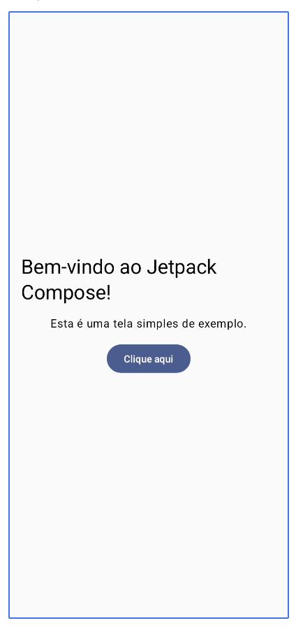

# Aula 04: Introdução ao Jetpack Compose

## Código da aula

<https://github.com/tads-ufpr-alexkutzke/ds151-aula-04-codes-jetpack-compose/>

## Referências

- [Pensando com Jetpack Compose](https://developer.android.com/develop/ui/compose/mental-model)
- [Passo-a-passo de exemplo sobre Compose](https://developer.android.com/develop/ui/compose/tutorial)
- [Sobre o pacote `androidx.compose`](https://developer.android.com/jetpack/androidx/releases/compose)
- [Jetpack Compose Playground](https://foso.github.io/Jetpack-Compose-Playground/)

## Jetpack Compose: A Nova Era do Desenvolvimento de Interfaces Android


- **Toolkit Moderno do Android**: Usado para construir interfaces de usuário (UI) de forma declarativa.
- **Diferença do Sistema Tradicional**:
  - *XML Tradicional*: Baseado em XML.
  - *Compose*: Descreve a UI como uma função transformando dados em elementos visuais.

### Benefícios do Jetpack Compose

- **Código Mais Simples e Conciso**: 
  - Reduz significativamente a quantidade de código necessário para criar interfaces.
- **Reutilização de Componentes**:
  - Facilita a criação de componentes que são reutilizáveis e personalizados.
- **Atualizações Dinâmicas**:
  - Apenas as partes da UI que precisam são recompostas, melhorando a performance.
- **Compatibilidade com Kotlin**:
  - Integra-se perfeitamente com a linguagem Kotlin, aproveitando ao máximo seus recursos modernos.
- **Animações Simplificadas**:
  - Possui APIs poderosas para a criação de animações complexas com facilidade.


### Conceitos Fundamentais

#### Funções de Composição

No Jetpack Compose, a UI é construída com funções chamadas funções de composição. Essas funções são anotadas com @Composable e descrevem um pedaço da UI.

```kotlin
@Composable
fun Greeting(name: String) {
    Text(text = "Olá, $name!")
}
```

#### Estado (State)

O estado é qualquer dado que pode mudar e influenciar a UI. Em Compose, usamos remember e mutableStateOf para armazenar e observar o estado.

```kotlin
@Composable
fun Counter() {
    var count by remember { mutableStateOf(0) }
    Button(onClick = { count++ }) {
        Text(text = "Contador: $count")
    }
}

```
#### Modificadores (Modifiers)

Modificadores são usados para decorar ou adicionar comportamento aos elementos da UI. Eles são encadeáveis e permitem configurar propriedades como tamanho, padding, cor, etc.

```kotlin
Text(
    text = "Olá, Compose!",
    modifier = Modifier
        .padding(16.dp)
        .background(Color.LightGray)
)
```

#### Layouts

Compose oferece vários layouts para organizar elementos na tela. Alguns dos mais comuns incluem:

- **Column**: Organiza os elementos verticalmente.
- **Row**: Organiza os elementos horizontalmente.
- **Box**: Permite sobrepor elementos.

```kotlin
@Composable
fun MyLayout() {
    Column {
        Text(text = "Elemento 1")
        Text(text = "Elemento 2")
    }
}
```

#### Exemplos Práticos

##### Exemplo 1: Lista Simples
 
Criar uma lista de itens usando LazyColumn.

```kotlin
@Composable
fun SimpleList() {
    val items = listOf("Item 1", "Item 2", "Item 3")
    LazyColumn {
        items(items) { item ->
            Text(text = item, modifier = Modifier.padding(8.dp))
        }
    }
}
```

##### Exemplo 2: Formulário de Login

Implementar um formulário de login com campos de texto e um botão.

```kotlin
@Composable
fun LoginForm() {
    var username by remember { mutableStateOf("") }
    var password by remember { mutableStateOf("") }

    Column(
        modifier = Modifier.padding(16.dp),
        verticalArrangement = Arrangement.spacedBy(8.dp)
    ) {
        TextField(
            value = username,
            onValueChange = { username = it },
            label = { Text("Usuário") }
        )
        TextField(
            value = password,
            onValueChange = { password = it },
            label = { Text("Senha") },
            visualTransformation = PasswordVisualTransformation()
        )
        Button(onClick = { /* Lógica de login aqui */ }) {
            Text("Entrar")
        }
    }
}
```

## Pensando com Jetpack Compose

### 1. Paradigma de Programação Declarativa
- **Modelo Tradicional**: Uso de uma hierarquia de visualização em árvore.
- **Desafios**: Alterações manuais que podem levar a erros e estados ilegais.
- **Abordagem Declarativa**: Simplifica a engenharia de UI ao aplicar mudanças necessárias, evitando complexidade de atualizações manuais.

### 2. Funções Composable
- Funções anotadas com `@Composable` para converter dados em UI.
- Funções que não retornam nada, emitindo diretamente o estado desejado da tela.

```kotlin
@Composable
fun Greeting(name: String) {
    Text(text = "Hello $name")
}
```

### 3. Recomposição


- **Modelo de UI Imperativa vs Compose**
  - No modelo imperativo, altere o estado de um widget usando setters.
  - No Compose, atualize chamando novamente a função Composable com novos dados.
  - Widgets são redesenhados apenas se necessário, graças à recomposição inteligente do Compose.

- **Exemplo de Função Composable**
  - ```kotlin
    @Composable
    fun ClickCounter(clicks: Int, onClick: () -> Unit) {
        Button(onClick = onClick) {
            Text("I've been clicked $clicks times")
        }
    }
    ```
  - Ao clicar no botão, a chamada atualiza `clicks` e a função `Text` é recomposta para mostrar o novo valor.

- **Eficiência na Recomputação**
  - Recomputação inteligente do Compose apenas para componentes que mudaram.
  - Isso economiza recursos computacionais e preserva a duração da bateria.
  - Ignora funções/lambdas sem parâmetros alterados, evitando recalcular desnecessariamente.

- **Cuidados com Efeitos Colaterais**
  - Evite depender de efeitos colaterais em funções composable.
  - Efeitos colaterais perigosos incluem:
    - Alterar propriedades de objetos compartilhados.
    - Atualizar elementos observáveis em ViewModel.
    - Modificar preferências compartilhadas.
  - Recomenda-se executar operações de alto custo em corrotinas em segundo plano.

- **Exemplo: Uso de SharedPreferences em Composable**
  - ```kotlin
    @Composable
    fun SharedPrefsToggle(
        text: String,
        value: Boolean,
        onValueChanged: (Boolean) -> Unit
    ) {
        Row {
            Text(text)
            Checkbox(checked = value, onCheckedChange = onValueChanged)
        }
    }
    ```
  - Atualizações de valor são geridas via callbacks e operações de fundo no ViewModel.

- **Considerações para Uso Eficiente do Compose**
  - **Recomposição Optimizada**:
    - A recomposição ignora funções/lambdas quando possível.
    - Pode ser cancelada se for desnecessária.
  - **Execução e Performance**:
    - Funções composable podem ser executadas em todos os frames de uma animação.
    - São executadas em paralelo e podem ocorrer em qualquer ordem.

- **Melhores Práticas**
  - Funções composable devem ser rápidas, idempotentes e sem efeitos colaterais para garantir compatibilidade e eficiência na recomposição.

#### Recomposição no Compose: Otimizações

- **Recomposição Seletiva**
  - O Compose limita a recomposição às partes da IU que realmente precisam de atualização.
  - Permite recompor um único elemento (por exemplo, um botão) sem afetar outros elementos na árvore da IU.

- **Funções e Lambdas Composable**
  - Todas as funções e lambdas podem ser recompostas individualmente.
  - Exemplo de como a recomposição pode ignorar elementos não alterados ao renderizar uma lista:

    ```kotlin
    /**
     * Exibe uma lista de nomes que o usuário pode clicar com um cabeçalho
     */
    @Composable
    fun NamePicker(
        header: String,
        names: List<String>,
        onNameClicked: (String) -> Unit
    ) {
        Column {
            // Recompõe quando [header] muda, mas não quando [names] muda
            Text(header, style = MaterialTheme.typography.bodyLarge)
            HorizontalDivider()

            // LazyColumn é a versão do Compose para RecyclerView.
            // A lambda passada para items() é semelhante a um RecyclerView.ViewHolder.
            LazyColumn {
                items(names) { name ->
                    // Recompõe quando o [name] do item atualiza. Não recompõe quando [header] muda
                    NamePickerItem(name, onNameClicked)
                }
            }
        }
    }

    /**
     * Exibe um nome individual que o usuário pode clicar.
     */
    @Composable
    private fun NamePickerItem(name: String, onClicked: (String) -> Unit) {
        Text(name, Modifier.clickable(onClick = { onClicked(name) }))
    }
    ```

- **Escopos de Recomputação**
  - Elementos podem ser recompostos individualmente sem necessidade de executar pais ou irmãos.
  - Alteração no `header` permite pular para a execução da `Column`, enquanto ignora `LazyColumn` se `names` não mudou.

- **Cuidados com Efeitos Colaterais**
  - Execução de funções composable não deve ter efeitos colaterais.
  - Efeitos colaterais devem ser acionados a partir de callbacks, garantindo que a recomposição não altere o estado de forma indesejada.


### 4. Recomposição Otimista
- Permite cancelamento e reinício da recomposição com novos parâmetros.
- Necessário garantir funções idempotentes e sem efeitos colaterais para manter a integridade.

### 5. Recomendações para Desenvolvimento
- Utilizar funções rápidas e sem efeitos colaterais.
- Evitar operações caras durante recomposição.
- Mover trabalhos intensivos para outras threads e utilizar estados mutáveis ou LiveData para gerenciar dados.

### Exemplo sobre execução em paralelo

```kotlin
@Composable
fun ListComposable(myList: List<String>) {
    Row(horizontalArrangement = Arrangement.SpaceBetween) {
        Column {
            for (item in myList) {
                Text("Item: $item")
            }
        }
        Text("Count: ${myList.size}")
    }
}
```
#### Explicação:
- **Layout Estruturado**:
  - **`Row` com `Arrangement.SpaceBetween`**: Os elementos ficam distribuídos ao longo do espaço disponível.
  - **`Column`**: Lista os itens fornecidos.
- **Contagem de Itens**: Mostra a contagem total de itens após a coluna.

```kotlin
@Composable
fun ListWithBug(myList: List<String>) {
    var items = 0

    Row(horizontalArrangement = Arrangement.SpaceBetween) {
        Column {
            for (item in myList) {
                Card {
                    Text("Item: $item")
                    items++ // Avoid! Side-effect of the column recomposing.
                }
            }
        }
        Text("Count: $items")
    }
}
```

### Ordem de execução

- Execução pode ocorrer em qualquer ordem;
- Por exemplo, no código abaixo:
  - Se `StartScreen` seta uma variável global (um efeito colateral) e que é utilizada por, digamos, `MiddleScreen`, não há garantias se a variável estará setada quando `MiddleScreen` rodar;

```kotlin
@Composable
fun ButtonRow() {
    MyFancyNavigation {
        StartScreen()
        MiddleScreen()
        EndScreen()
    }
}
```

## Tutorial Passo-a-passo

Resumo e tradução do [tutorial da documentação oficial](https://developer.android.com/develop/ui/compose/tutorial).

### Conceitos Básicos de Compose

1. **Funções de Composição (Composable Functions)**
   - Define a UI do app programaticamente.
   - Use a anotação `@Composable` para funções de composição.
   - Exemplo: Adicionar um elemento de texto com a função `Text`.

   ```kotlin
   import android.os.Bundle
   import androidx.activity.ComponentActivity
   import androidx.activity.compose.setContent
   import androidx.compose.material3.Text

   class MainActivity : ComponentActivity() {
       override fun onCreate(savedInstanceState: Bundle?) {
           super.onCreate(savedInstanceState)
           setContent {
               Text("Hello world!")
           }
       }
   }
   ```

2. **Visualização de Funções de Composição**
   - Utilizar a anotação `@Preview` para visualizar funções no Android Studio.
   - Criação de uma função de pré-visualização para ver a composição sem parâmetros.

   ```kotlin
   import androidx.compose.runtime.Composable
   import androidx.compose.ui.tooling.preview.Preview

   @Composable
   fun MessageCard(name: String) {
       Text(text = "Hello $name!")
   }

   @Preview
   @Composable
   fun PreviewMessageCard() {
       MessageCard("Android")
   }
   ```

### Desenvolvimento de Layouts
1. **Hierarquia de Elementos de UI**
   - Construir hierarquias de UI com funções de composição.
   - Exemplo: Usar `Column` para dispor elementos verticalmente.

   ```kotlin
   import androidx.compose.foundation.layout.Column

   data class Message(val author: String, val body: String)

   @Composable
   fun MessageCard(msg: Message) {
       Column {
           Text(text = msg.author)
           Text(text = msg.body)
       }
   }

   @Preview
   @Composable
   fun PreviewMessageCard() {
       MessageCard(
           msg = Message("Lexi", "Hey, take a look at Jetpack Compose, it's great!")
       )
   }
   ```

2. **Adicionar Elementos de Texto e Imagem**
   - Exemplo de código para adicionar múltiplos textos e imagens.
   - Uso de `Row` e `Image` para estruturar elementos.

   ```kotlin
   import androidx.compose.foundation.Image
   import androidx.compose.foundation.layout.Row
   import androidx.compose.ui.res.painterResource

   @Composable
   fun MessageCard(msg: Message) {
       Row {
           Image(
               painter = painterResource(R.drawable.profile_picture),
               contentDescription = "Contact profile picture",
           )
           Column {
               Text(text = msg.author)
               Text(text = msg.body)
           }
       }
   }
   ```

- Baixe a [imagem de exemplo](https://developer.android.com/static/develop/ui/compose/images/compose-tutorial/profile_picture.png):
  - Utilize o Resource Manager no Android Studio para adicionar a imagem aos recursos da aplicação.

3. **Configuração do Layout**
   - Uso de modificadores para alterar tamanho, layout e aparência.
   - Exemplo de código com modificadores como `padding`, `size` e `clip`.

   ```kotlin
   import androidx.compose.foundation.border
   import androidx.compose.foundation.layout.Spacer
   import androidx.compose.foundation.layout.height
   import androidx.compose.foundation.layout.padding
   import androidx.compose.foundation.layout.size
   import androidx.compose.foundation.layout.width
   import androidx.compose.foundation.shape.CircleShape
   import androidx.compose.ui.Modifier
   import androidx.compose.ui.draw.clip
   import androidx.compose.ui.unit.dp

   @Composable
   fun MessageCard(msg: Message) {
       Row(modifier = Modifier.padding(all = 8.dp)) {
           Image(
               painter = painterResource(R.drawable.profile_picture),
               contentDescription = "Contact profile picture",
               modifier = Modifier
                   .size(40.dp)
                   .clip(CircleShape)
           )
           Spacer(modifier = Modifier.width(8.dp))
           Column {
               Text(text = msg.author)
               Spacer(modifier = Modifier.height(4.dp))
               Text(text = msg.body)
           }
       }
   }
   ```

### Design com Material Design

1. **Uso do Design Material**
   - Implementação de Material Design 3.
   - Uso de `Surface` e tema `ComposeTutorialTheme` para consistência de estilo.

   ```kotlin
   class MainActivity : ComponentActivity() {
       override fun onCreate(savedInstanceState: Bundle?) {
       super.onCreate(savedInstanceState)
       enableEdgeToEdge()
       setContent {
           Aula04JetPackComposeTheme {
            Scaffold(modifier = Modifier.fillMaxSize()) { innerPadding ->
              MessageCard(Message("Android", "Jetpack Compose"))
            }
          }
       }
     }
   }

   @Preview
   @Composable
   fun PreviewMessageCard() {
       Aula04JetPackComposeTheme {
           Surface {
               MessageCard(
                   msg = Message("Lexi", "Take a look at Jetpack Compose, it's great!")
               )
           }
       }
   }
   ```

2. **Aplicando Estilos com `MaterialTheme`**
   - Cores: Uso de `MaterialTheme.colorScheme`.
   - Tipografia: Uso de `MaterialTheme.typography`.
   - Formas: Ajustes de bordas e elevação de elementos.

   ```kotlin
   import androidx.compose.foundation.border
   import androidx.compose.material3.MaterialTheme

   @Composable
   fun MessageCard(msg: Message) {
       Row(modifier = Modifier.padding(all = 8.dp)) {
           Image(
               painter = painterResource(R.drawable.profile_picture),
               contentDescription = null,
               modifier = Modifier
                   .size(40.dp)
                   .clip(CircleShape)
                   .border(1.5.dp, MaterialTheme.colorScheme.primary, CircleShape)
           )

           Spacer(modifier = Modifier.width(8.dp))

           Column {
               Text(
                   text = msg.author,
                   color = MaterialTheme.colorScheme.secondary,
                   style = MaterialTheme.typography.titleSmall
               )

               Spacer(modifier = Modifier.height(4.dp))
               Text(
                   text = msg.body,
                   style = MaterialTheme.typography.bodyMedium
               )
           }
       }
   }
   ```

### Trabalhando com Temas

1. **Habilitação do Tema Escuro**
   - Suporte nativo a tema escuro com adaptação de cores automáticas.
   - Uso de múltiplas anotações de pré-visualização para ver temas claro e escuro.

   ```kotlin
   import android.content.res.Configuration


   @Preview(name = "Light Mode")
   @Preview(
       uiMode = Configuration.UI_MODE_NIGHT_YES,
       showBackground = true,
       name = "Dark Mode"
   )
   @Composable
   fun PreviewMessageCard() {
       Aula04JetPackComposeTheme {
           Surface {
               MessageCard(
                   msg = Message("Lexi", "Take a look at Jetpack Compose, it's great!")
               )
           }
       }
   }
   ```
### Listas e Animações

1. **Criação de Listas de Mensagens**
   - Uso de `LazyColumn` e `LazyRow` para eficiência.
   - Exemplo de código para criar uma função `Conversation` exibindo múltiplas mensagens.

   ```kotlin
   import androidx.compose.foundation.lazy.LazyColumn
   import androidx.compose.foundation.lazy.items

   @Composable
   fun Conversation(messages: List<Message>) {
       LazyColumn {
           items(messages) { message ->
               MessageCard(message)
           }
       }
   }

   @Preview
   @Composable
   fun PreviewConversation() {
       Aula04JetPackComposeTheme {
           Conversation(SampleData.conversationSample)
       }
   }
   ```

   Adicione as imagens fictícias no arquivo `MainActivity.kt`

   ```kotlin
    /**
    * SampleData for Jetpack Compose Tutorial 
    */
    object SampleData {
        // Sample conversation data
        val conversationSample = listOf(
            Message(
                "Lexi",
                "Test...Test...Test..."
            ),
            Message(
                "Lexi",
                """List of Android versions:
                |Android KitKat (API 19)
                |Android Lollipop (API 21)
                |Android Marshmallow (API 23)
                |Android Nougat (API 24)
                |Android Oreo (API 26)
                |Android Pie (API 28)
                |Android 10 (API 29)
                |Android 11 (API 30)
                |Android 12 (API 31)""".trim()
            ),
            Message(
                "Lexi",
                """I think Kotlin is my favorite programming language.
                |It's so much fun!""".trim()
            ),
            Message(
                "Lexi",
                "Searching for alternatives to XML layouts..."
            ),
            Message(
                "Lexi",
                """Hey, take a look at Jetpack Compose, it's great!
                |It's the Android's modern toolkit for building native UI.
                |It simplifies and accelerates UI development on Android.
                |Less code, powerful tools, and intuitive Kotlin APIs :)""".trim()
            ),
            Message(
                "Lexi",
                "It's available from API 21+ :)"
            ),
            Message(
                "Lexi",
                "Writing Kotlin for UI seems so natural, Compose where have you been all my life?"
            ),
            Message(
                "Lexi",
                "Android Studio next version's name is Arctic Fox"
            ),
            Message(
                "Lexi",
                "Android Studio Arctic Fox tooling for Compose is top notch ^_^"
            ),
            Message(
                "Lexi",
                "I didn't know you can now run the emulator directly from Android Studio"
            ),
            Message(
                "Lexi",
                "Compose Previews are great to check quickly how a composable layout looks like"
            ),
            Message(
                "Lexi",
                "Previews are also interactive after enabling the experimental setting"
            ),
            Message(
                "Lexi",
                "Have you tried writing build.gradle with KTS?"
            ),
        )
    }
   ```


2. **Animação de Mensagens**
   - Uso de funções `remember` e `mutableStateOf` para gerenciar estado local.
   - Exemplo de código para animar cor e tamanho de mensagens ao expandir.

   ```kotlin
   import androidx.compose.foundation.clickable
   import androidx.compose.runtime.getValue
   import androidx.compose.runtime.mutableStateOf
   import androidx.compose.runtime.remember
   import androidx.compose.runtime.setValue
   import androidx.compose.animation.animateColorAsState
   import androidx.compose.animation.animateContentSize

   @Composable
   fun MessageCard(msg: Message) {
       Row(modifier = Modifier.padding(all = 8.dp)) {
           Image(
               painter = painterResource(R.drawable.profile_picture),
               contentDescription = null,
               modifier = Modifier
                   .size(40.dp)
                   .clip(CircleShape)
                   .border(1.5.dp, MaterialTheme.colorScheme.secondary, CircleShape)
           )
           Spacer(modifier = Modifier.width(8.dp))

           var isExpanded by remember { mutableStateOf(false) }
           val surfaceColor by animateColorAsState(
               if (isExpanded) MaterialTheme.colorScheme.primary else MaterialTheme.colorScheme.surface,
           )

           Column(modifier = Modifier.clickable { isExpanded = !isExpanded }) {
               Text(
                   text = msg.author,
                   color = MaterialTheme.colorScheme.secondary,
                   style = MaterialTheme.typography.titleSmall
               )

               Spacer(modifier = Modifier.height(4.dp))

               Surface(
                   shape = MaterialTheme.shapes.medium,
                   shadowElevation = 1.dp,
                   color = surfaceColor,
                   modifier = Modifier.animateContentSize().padding(1.dp)
               ) {
                   Text(
                       text = msg.body,
                       modifier = Modifier.padding(all = 4.dp),
                       maxLines = if (isExpanded) Int.MAX_VALUE else 1,
                       style = MaterialTheme.typography.bodyMedium
                   )
               }
           }
       }
   }
   ```

### Exercícios para praticar

#### Exercício 1: Tela simples centralizada

Altere o código do repositório da aula de modo que o componente `SimpleScreen` fique com a seguinte aparência:



#### Exercício 2: Criar um Perfil de Usuário
Crie uma tela que exiba informações de um perfil de usuário, como nome, foto e descrição. Utilize Column, Row, Image e Text para estruturar a UI.
