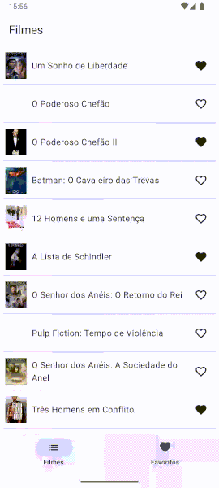
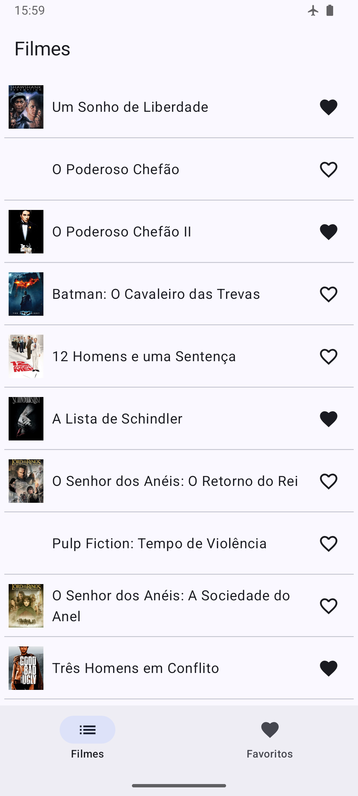

# 09 - Persistência de dados local com Room


## Room

O Room é uma **biblioteca de persistência de dados** do Android que facilita o armazenamento e o gerenciamento de dados locais **em bancos de dados SQLite**. 

Ele fornece uma **camada de abstração** sobre o SQLite, permitindo que os desenvolvedores definam entidades, consultem e manipulem dados utilizando objetos e métodos Java/Kotlin de forma simples, segura e eficiente. 

Com o Room, é possível manter o **código mais organizado, evitar erros comuns de SQL** e aproveitar recursos como verificação de consultas em tempo de compilação e integração direta com o ciclo de vida do aplicativo.


### Componentes Principais do Room

O Room possui três componentes principais:

- Classe de banco de dados: Gerencia o banco de dados e é o principal ponto de acesso para os dados persistidos do aplicativo.
- Entidades de dados: Representam as tabelas do banco de dados do app.
- DAOs (Data Access Objects): Fornecem métodos para consultar, atualizar, inserir e deletar dados no banco.

A classe de banco de dados fornece instâncias dos DAOs, que permitem ao app acessar e manipular os dados como objetos correspondentes às entidades definidas. Dessa forma, o app pode recuperar, inserir ou atualizar informações nas tabelas do banco com facilidade.


### Exemplo simples

#### Entidades

```kotlin
@Entity
data class User(
    @PrimaryKey val uid: Int,
    @ColumnInfo(name = "first_name") val firstName: String?,
    @ColumnInfo(name = "last_name") val lastName: String?
)
```

#### DAO

```kotlin
@Dao
interface UserDao {
    @Query("SELECT * FROM user")
    fun getAll(): List<User>

    @Query("SELECT * FROM user WHERE uid IN (:userIds)")
    fun loadAllByIds(userIds: IntArray): List<User>

    @Query("SELECT * FROM user WHERE first_name LIKE :first AND " +
           "last_name LIKE :last LIMIT 1")
    fun findByName(first: String, last: String): User

    @Insert
    fun insertAll(vararg users: User)

    @Delete
    fun delete(user: User)
}
```

#### Database

```kotlin
@Database(entities = [User::class], version = 1)
abstract class AppDatabase : RoomDatabase() {
    abstract fun userDao(): UserDao
}
```


#### Uso básico

Primeiro precisamos gerar o objeto da Database:

```kotlin
val db = Room.databaseBuilder(
            applicationContext,
            AppDatabase::class.java, "database-name"
        ).build()
```

Na sequência, utilizamos a instâncias `db` para acessar os dados através das DAOs disponíveis:

```kotlin
val userDao = db.userDao()
val users: List<User> = userDao.getAll()
```

## Aplicação exemplo: MoviesApp

A versão final da aplicação pode ser acessada no seguinte repositório:<br>
<https://github.com/tads-ufpr-alexkutzke/ds151-aula-09-movies-api-room-app>

A aplicação exemplo segue o desenvolvimento da última aula, com a adição de armazenamento local com Room.
O objetivo da aplicação é que o usuário possa salvar localmente os dados dos filmes marcados como favoritos. Esses dados devem ser acessíveis mesmo sem acesso à internet.

<p>
  
</p>

A organização dos arquivos nessa aplicação foi melhorada. Agora temos arquivos separados em pastas que indicam suas funções. A estrutura é a seguinte:

```
app/src/main/java/com/example/moviesapp/
├── AppContextHolder.kt
├── Application.kt
├── data
│   ├── local
│   │   ├── CastConverter.kt
│   │   ├── FavoriteMovieDao.kt
│   │   ├── FavoriteMovieEntity.kt
│   │   └── FavoriteMoviesDatabase.kt
│   ├── LocalFavoriteMoviesRepository.kt
│   ├── LocalFavoriteMoviesRepositoryProvider.kt
│   ├── RemoteMoviesRepository.kt
│   └── RemoteMoviesRepositoryProvider.kt
├── MainActivity.kt
├── model
│   ├── Movie.kt
│   └── Review.kt
├── network
│   └── MoviesApiService.kt
├── ui
│   ├── moviesapp
│   │   ├── ApiComposables.kt
│   │   ├── MovieDetailsScreen.kt
│   │   ├── MovieDetailsViewModel.kt
│   │   ├── MovieItem.kt
│   │   ├── MoviesList.kt
│   │   ├── MoviesListViewModel.kt
│   │   └── MoviesScreen.kt
│   ├── MoviesApp.kt
│   └── theme
│       ├── Color.kt
│       ├── Theme.kt
│       └── Type.kt
└── utils
    └── MapperExtensions.kt
```

O conteúdo de cada pasta é o seguinte:

- `data/`: arquivos relativos a repositórios de dados, sejam locais ou remotos. Aqui armazenamos os itens conhecidos como Repositórios;
  - `data/local/`: arquivos relativos ao armazenamento local de dados (*Database*, *DAO* e *Entity*);
- `model`: arquivos que definem os modelos dos dados utilizados. Em geral, determinam os tipos de dados relevantes para a aplicação;
- `network/`: arquivos relacionados à requisições para APIs. No caso, arquivos de definição do `Retrofit`;
- `ui/` arquivos da interface (`Composables` e `ViewModels`);
- `utils/`: arquivos auxiliares;

> [!IMPORTANT]
> Nesse projeto, utilizamos uma paradigma de repositórios para abstrair todo o acesso aos dados da aplicação. Por essa razão, uma
> certa quantidade de código *boilerplate* precisou ser adicionada (vide os arquivos de *providers*).
> Esse efeito pode ser sensivelmente diminuído através do uso de Injeção de Dependências (DI - *Dependencies Injection*). No desenvolvimento
> Android, isso geralmente é realizado com o auxílio da biblioteca [Hilt](https://developer.android.com/training/dependency-injection/hilt-android?hl=pt-br).

### Dependências

Algumas dependências são necessárias para o uso do Room (`app/build.gradle.kts`):

```kotlin
plugins {
    // ...
    id("com.google.devtools.ksp")
}

dependencies {

    // ...

    val room_version = "2.7.1"

    implementation("androidx.room:room-runtime:$room_version")

    ksp("androidx.room:room-compiler:$room_version")

    // ...

}
```

Atenção ao plugin `ksp` adicionado. Além disso, esse plugin deve ser adicionado, também, ao arquivo `build.gradle.kts` do projeto:

```kotlin
// Top-level build file where you can add configuration options common to all sub-projects/modules.
plugins {
    alias(libs.plugins.android.application) apply false
    alias(libs.plugins.kotlin.android) apply false
    alias(libs.plugins.kotlin.compose) apply false
    id("com.google.devtools.ksp") version "2.0.21-1.0.27" apply false
}
```

### Model

Antes de abordarmos a implementação do acesso aos dados locais, devemos conhecer quais são os tipos de dados utilizados na lógica da aplicação

#### Movie.kt

Define a classe Movie:

```kotlin
class Movie(
    val id: Int,
    val title: String,
    val cast: List<String>,
    val director: String,
    val synopsis: String,
    val posterUrl: String,
) {
}
```

<details>
<summary><code>Movie.kt</code></summary>

```kotlin
package com.example.moviesapp.model

class Movie(
    val id: Int,
    val title: String,
    val cast: List<String>,
    val director: String,
    val synopsis: String,
    val posterUrl: String,
) {
}

val fourMovies: List<Movie> = listOf(
    Movie(
        id = 1,
        title = "Um Sonho de Liberdade",
        cast = listOf("Tim Robbins", "Morgan Freeman", "William Sadler"),
        director = "Frank Darabont",
        synopsis = "Acusado injustamente de assassinato, Andy Dufresne encontra esperança e redenção na prisão de Shawshank.",
        posterUrl = "https://image.tmdb.org/t/p/w500/q6y0Go1tsGEsmtFryDOJo3dEmqu.jpg",
    ),
    Movie(
        id = 2,
        title = "O Poderoso Chefão",
        cast = listOf("Marlon Brando", "Al Pacino", "James Caan"),
        director = "Francis Ford Coppola",
        synopsis = "A trajetória da família mafiosa Corleone e os desafios enfrentados no submundo do crime.",
        posterUrl = "https://image.tmdb.org/t/p/w500/d4KNaTrltq6bpkFS01pYtyXa09m.jpg",
    ),
    Movie(
        id = 3,
        title = "O Poderoso Chefão II",
        cast = listOf("Al Pacino", "Robert De Niro", "Robert Duvall"),
        director = "Francis Ford Coppola",
        synopsis = "Expande a saga dos Corleone, explorando passado e presente da família mafiosa.",
        posterUrl = "https://image.tmdb.org/t/p/w500/amvmeQWheahG3StKwIE1f7jRnkZ.jpg",
    ),
    Movie(
        id = 4,
        title = "Batman: O Cavaleiro das Trevas",
        cast = listOf("Christian Bale", "Heath Ledger", "Aaron Eckhart"),
        director = "Christopher Nolan",
        synopsis = "O Coringa ameaça destruir Gotham, e Batman precisa lidar com caos e sacrifícios pessoais.",
        posterUrl = "https://image.tmdb.org/t/p/w500/qJ2tW6WMUDux911r6m7haRef0WH.jpg",
    ),
)

```

</details>

#### Review.kt

Define a classe Review:

```kotlin
class Review(
    val id: Int,
    val movieId: Int,
    val author: String,
    val reviewText: String,
    val rating: Int,
) {
}
```

<details>
<summary><code>Review.kt</code></summary>

```kotlin
package com.example.moviesapp.model

class Review(
    val id: Int,
    val movieId: Int,
    val author: String,
    val reviewText: String,
    val rating: Int,
) {
}

val fourReviews: List<Review> = listOf(
    Review(
        id = 1,
        movieId = 1,
        author = "João Silva",
        reviewText = "Uma história inspiradora sobre esperança, amizade e redenção. Atuações impecáveis de Tim Robbins e Morgan Freeman.",
        rating = 10
    ),
    Review(
        id = 2,
        movieId = 1,
        author = "Ana Souza",
        reviewText = "O filme emociona do começo ao fim, com uma narrativa envolvente e um final perfeito.",
        rating = 9
    ),
        Review(
        id = 3,
        movieId = 1,
        author = "Carlos Mendes",
        reviewText = "Roteiro cativante e personagens profundos. Um clássico absoluto do cinema.",
        rating = 10
    ),
)
```

</details>

### Data

Analisaremos os arquivos presentes na pasta `data/` do projeto. São, portanto, responsáveis por toda definição, acesso e abstração dos dados utilizados na aplicação.

#### Data/Local

Os arquivos presentes em `data/local` tem a função de definir e implementar o acesso aos dados locais, por meio do uso do *Room*.

##### FavoriteMovieEntity.kt

Este arquivo define a *Entity* que representa um filme favorito na base de dados local:

```kotlin
@Entity(tableName = "favorite_movies")
@TypeConverters(CastConverter::class)
data class FavoriteMovieEntity(
    @PrimaryKey val id: Int,
    val title: String,
    val cast: List<String>,
    val director: String,
    val synopsis: String,
    val posterUrl: String
)
```

<details>
<summary><code>FavoriteMovieEntity.kt</code></summary>

```kotlin
package com.example.moviesapp.data.local

import androidx.room.Entity
import androidx.room.PrimaryKey
import androidx.room.TypeConverters

@Entity(tableName = "favorite_movies")
@TypeConverters(CastConverter::class)
data class FavoriteMovieEntity(
    @PrimaryKey val id: Int,
    val title: String,
    val cast: List<String>,
    val director: String,
    val synopsis: String,
    val posterUrl: String
)
```

</details>

##### FavoriteMovieDao.kt

Agora temos a definição do DAO, responsável pelo acesso às entidades `FavoriteMovieEntity` na base de dados local:

```kotlin
@Dao
interface FavoriteMovieDao {
    @Query("SELECT * FROM favorite_movies")
    suspend fun getAll(): List<FavoriteMovieEntity>

    @Query("SELECT * FROM favorite_movies WHERE id = :movieId")
    suspend fun getById(movieId: Int): FavoriteMovieEntity?

    @Insert(onConflict = OnConflictStrategy.REPLACE)
    suspend fun insert(movie: FavoriteMovieEntity)

    @Delete
    suspend fun delete(movie: FavoriteMovieEntity)
}
```


<details>
<summary><code>FavoriteMovieDao.kt</code></summary>

```kotlin
package com.example.moviesapp.data.local

import androidx.room.*

@Dao
interface FavoriteMovieDao {
    @Query("SELECT * FROM favorite_movies")
    suspend fun getAll(): List<FavoriteMovieEntity>

    @Query("SELECT * FROM favorite_movies WHERE id = :movieId")
    suspend fun getById(movieId: Int): FavoriteMovieEntity?

    @Insert(onConflict = OnConflictStrategy.REPLACE)
    suspend fun insert(movie: FavoriteMovieEntity)

    @Delete
    suspend fun delete(movie: FavoriteMovieEntity)
}

```

</details>

##### FavoriteMoviesDatabase

Por fim, temos a definição da própria base de dados local, com `FavoriteMoviesDatabase`:

```kotlin
@Database(entities = [FavoriteMovieEntity::class], version = 1)
@TypeConverters(CastConverter::class)
abstract class FavoriteMoviesDatabase : RoomDatabase() {
    abstract fun favoriteMovieDao(): FavoriteMovieDao

    companion object {
        @Volatile private var INSTANCE: FavoriteMoviesDatabase? = null

        fun getInstance(context: Context): FavoriteMoviesDatabase {
            return INSTANCE ?: synchronized(this) {
                INSTANCE ?: Room.databaseBuilder(
                    context.applicationContext,
                    FavoriteMoviesDatabase::class.java,
                    "favorites.db"
                ).build().also { INSTANCE = it }
            }
        }
    }
}
```

Aqui vale notar como a estrutura de definição de um Database está mais complexa do que no exemplo inicial deste material.
Isso se deve ao fato de que o código acima garante que apenas um objeto de `FavoriteMoviesDatabase` seja instanciado para toda
a aplicação, não importando quantas vezes `getInstance` seja chamado.

Perceba, porém, que o código central ainda é uma simples chamada para `Room.databaseBuilder`:

```kotlin
                INSTANCE ?: Room.databaseBuilder(
                    context.applicationContext,
                    FavoriteMoviesDatabase::class.java,
                    "favorites.db"
                ).build().also { INSTANCE = it }
```


<details>
<summary><code>FavoriteMoviesDatabase.kt</code></summary>

```kotlin
package com.example.moviesapp.data.local

import android.content.Context
import androidx.room.Database
import androidx.room.Room
import androidx.room.RoomDatabase
import androidx.room.TypeConverters

@Database(entities = [FavoriteMovieEntity::class], version = 1)
@TypeConverters(CastConverter::class)
abstract class FavoriteMoviesDatabase : RoomDatabase() {
    abstract fun favoriteMovieDao(): FavoriteMovieDao

    companion object {
        @Volatile private var INSTANCE: FavoriteMoviesDatabase? = null

        fun getInstance(context: Context): FavoriteMoviesDatabase {
            return INSTANCE ?: synchronized(this) {
                INSTANCE ?: Room.databaseBuilder(
                    context.applicationContext,
                    FavoriteMoviesDatabase::class.java,
                    "favorites.db"
                ).build().also { INSTANCE = it }
            }
        }
    }
}
```


Perceba que para instanciar uma *Database* com `databaseBuilder`, precisamos de uma variável chamada `context: Context`.

No desenvolvimento Android, a variável context representa uma referência ao ambiente atual do aplicativo. O context fornece acesso a recursos e funcionalidades fundamentais do sistema, como arquivos, bancos de dados, preferências, serviços do sistema e componentes da interface. Ele é essencial para muitas operações, como exibir uma tela, acessar arquivos ou iniciar novas atividades. Existem diferentes tipos de contextos, como o `ApplicationContext` (referente ao ciclo de vida do app) e o `ActivityContext` (relacionado à atividade em execução).

No aplicativo exemplo, temos uma pequena alteração para que esse Contexto esteja disponível em qualquer arquivo do código. Essa alteração envolve os arquivos `MainActivity.kt`, `Application.kt` e `AppContextHolder.kt`, que serão abordados mais a frente.

</details>

##### CastConverter.kt

Ainda na pasta `data/local` temos um arquivo utilitário, responsável por realizar uma simples conversão de dados. Essa conversão é necessária pois, um dos campos de `Movie` é a lista `cast: List<String>`. Assim, convertemos essa lista para uma String que poderá ser serializada no momento de recuperação desse dado:

```kotlin
class CastConverter {
    @TypeConverter
    fun fromList(list: List<String>): String = list.joinToString(separator = ";")
    @TypeConverter
    fun toList(str: String): List<String> =
        if (str.isEmpty()) emptyList() else str.split(";")
}
```


<details>
<summary><code>CastConverter.kt</code></summary>

```kotlin
package com.example.moviesapp.data.local
 
import androidx.room.TypeConverter
 
class CastConverter {
    @TypeConverter
    fun fromList(list: List<String>): String = list.joinToString(separator = ";")
    @TypeConverter
    fun toList(str: String): List<String> =
        if (str.isEmpty()) emptyList() else str.split(";")
}
```

</details>

### Data - Arquivos de repositories e providers

O restante da pasta `data/` define nossos *repositories* e *providers*.

Um repository é uma camada de abstração responsável por gerenciar o acesso a diferentes fontes de dados, como banco de dados local (Room), serviços de rede (API), ou arquivos. Ele centraliza a lógica de obtenção, armazenamento e atualização de dados, oferecendo uma interface única para as demais partes do app (por exemplo, ViewModels). O uso do repository facilita a manutenção, os testes e a reutilização do código.

Um provider, por sua vez, é uma classe responsável por criar e/ou fornecer uma única instância de um objeto, geralmente utilizando o padrão *Singleton*. Por exemplo, um provider pode ser usado para produzir uma instância única do repository ao longo de toda a aplicação, garantindo que todos os componentes utilizem o mesmo objeto compartilhado. Essa abordagem facilita o gerenciamento do ciclo de vida das dependências e promove a reutilização e consistência no acesso aos recursos.

No caso da aplicação exemplo, temos repositories e providers para acesso remoto (API) e acesso local (Room).

##### Repository local

```kotlin
class LocalFavoriteMoviesRepository(private val dao: FavoriteMovieDao) {
    suspend fun getAllFavorites(): List<FavoriteMovieEntity> = dao.getAll()
    suspend fun getFavorite(movieId: Int): FavoriteMovieEntity? = dao.getById(movieId)
    suspend fun isFavorite(movieId: Int): Boolean = dao.getById(movieId) != null
    suspend fun addFavorite(movie: FavoriteMovieEntity) = dao.insert(movie)
    suspend fun removeFavorite(movie: FavoriteMovieEntity) = dao.delete(movie)
}
```


<details>
<summary><code>LocalFavoriteMoviesRepository.kt</code></summary>

```kotlin
package com.example.moviesapp.data

import com.example.moviesapp.data.local.FavoriteMovieEntity
import com.example.moviesapp.data.local.FavoriteMovieDao

class LocalFavoriteMoviesRepository(private val dao: FavoriteMovieDao) {
    suspend fun getAllFavorites(): List<FavoriteMovieEntity> = dao.getAll()
    suspend fun getFavorite(movieId: Int): FavoriteMovieEntity? = dao.getById(movieId)
    suspend fun isFavorite(movieId: Int): Boolean = dao.getById(movieId) != null
    suspend fun addFavorite(movie: FavoriteMovieEntity) = dao.insert(movie)
    suspend fun removeFavorite(movie: FavoriteMovieEntity) = dao.delete(movie)
}
```

</details>

##### Provider local

```kotlin
object LocalFavoriteMoviesRepositoryProvider {

    @Volatile private var instance: LocalFavoriteMoviesRepository? = null

    fun getRepository(context: Context): LocalFavoriteMoviesRepository {
        return instance ?: synchronized(this) {
            instance ?: LocalFavoriteMoviesRepository(
                FavoriteMoviesDatabase.getInstance(context).favoriteMovieDao()
            ).also { instance = it }
        }
    }
}

```

<details>
<summary><code>LocalFavoriteMoviesRepositoryProvider.kt</code></summary>

```kotlin
package com.example.moviesapp.data

import android.content.Context
import com.example.moviesapp.data.local.FavoriteMoviesDatabase

object LocalFavoriteMoviesRepositoryProvider {

    @Volatile private var instance: LocalFavoriteMoviesRepository? = null

    fun getRepository(context: Context): LocalFavoriteMoviesRepository {
        return instance ?: synchronized(this) {
            instance ?: LocalFavoriteMoviesRepository(
                FavoriteMoviesDatabase.getInstance(context).favoriteMovieDao()
            ).also { instance = it }
        }
    }
}
```

</details>

##### Repository remoto

```kotlin
class RemoteMoviesRepository(
    private val apiService: MoviesApiService
) {
    suspend fun getMovies(): List<Movie> {
        return apiService.getMovies()
    }
 
    suspend fun getMovie(id: Int): Movie {
        return apiService.getMovie(id)
    }
 
    suspend fun getReviews(movieId: Int): List<Review> {
        return apiService.getReviews(movieId)
    }
}
```

<details>
<summary><code>RemoteMoviesRepository.kt</code></summary>

```kotlin
package com.example.moviesapp.data
 
import com.example.moviesapp.network.MoviesApiService
import com.example.moviesapp.model.Movie
import com.example.moviesapp.model.Review
 
class RemoteMoviesRepository(
    private val apiService: MoviesApiService
) {
    suspend fun getMovies(): List<Movie> {
        return apiService.getMovies()
    }
 
    suspend fun getMovie(id: Int): Movie {
        return apiService.getMovie(id)
    }
 
    suspend fun getReviews(movieId: Int): List<Review> {
        return apiService.getReviews(movieId)
    }
}
```

</details>

##### Provider remoto

```kotlin
object RemoteMoviesRepositoryProvider {
    val repository: RemoteMoviesRepository by lazy {
        RemoteMoviesRepository(MoviesApi.retrofitService)
    }
}
```

<details>
<summary><code>RemoteMoviesRepositoryProvider.kt</code></summary>

```kotlin
package com.example.moviesapp.data
 
import com.example.moviesapp.network.MoviesApi
 
object RemoteMoviesRepositoryProvider {
    val repository: RemoteMoviesRepository by lazy {
        RemoteMoviesRepository(MoviesApi.retrofitService)
    }
}
```

</details>

## Network

A pasta `network/` armazena o arquivo para configuração do `Retrofit`. Diferentemente da última aula, agora temos endpoints para acessar reviews:

```kotlin
interface MoviesApiService {
    @GET("/movies")
    suspend fun getMovies(): List<Movie>

    @GET("/movies/{id}")
    suspend fun getMovie(@Path("id") id:Int): Movie

    @GET("/movie/{movieId}/reviews")
    suspend fun getReviews(@Path("movieId") movieId:Int): List<Review>
}

object MoviesApi {
    val retrofitService: MoviesApiService by lazy {
        retrofit.create(MoviesApiService::class.java)
    }
}
```


<details>
<summary><code>MoviesApiService.kt</code></summary>

```kotlin
package com.example.moviesapp.network

import com.example.moviesapp.model.Movie
import com.example.moviesapp.model.Review
import retrofit2.Retrofit
import retrofit2.converter.gson.GsonConverterFactory
import retrofit2.http.GET
import retrofit2.http.Path

private const val BASE_URL =
    "https://moviesapi.kutzke.com.br"

private val retrofit = Retrofit.Builder()
    .addConverterFactory(GsonConverterFactory.create())
    .baseUrl(BASE_URL)
    .build()

interface MoviesApiService {
    @GET("/movies")
    suspend fun getMovies(): List<Movie>

    @GET("/movies/{id}")
    suspend fun getMovie(@Path("id") id:Int): Movie

    @GET("/movie/{movieId}/reviews")
    suspend fun getReviews(@Path("movieId") movieId:Int): List<Review>
}

object MoviesApi {
    val retrofitService: MoviesApiService by lazy {
        retrofit.create(MoviesApiService::class.java)
    }
}
```

</details>

### Utils

O arquivo `utils/MapperExtensions.kt` é opcional. Ele realizar conversões entre dados locais e modelos da aplicação. Mas esse tipo de conversão não precisa ser utilizado. Por exemplo, o DAO poderia retornar diretamente um tipo Movie.

Porém, para que a abstração fique ainda mais evidente, fizemos uso dessa conversão.

```kotlin
fun Movie.toFavoriteEntity() = FavoriteMovieEntity(
    id, title, cast, director, synopsis, posterUrl
)

fun FavoriteMovieEntity.toMovie() = Movie(
    id, title, cast, director, synopsis, posterUrl
)
```

<details>
<summary><code>MapperExtensions.kt</code></summary>

``` kotlin
package com.example.moviesapp.utils

import com.example.moviesapp.model.Movie
import com.example.moviesapp.data.local.FavoriteMovieEntity

fun Movie.toFavoriteEntity() = FavoriteMovieEntity(
    id, title, cast, director, synopsis, posterUrl
)

fun FavoriteMovieEntity.toMovie() = Movie(
    id, title, cast, director, synopsis, posterUrl
)
```

</details>

## Ui

A partir daqui, os arquivos seguem, mais ou menos, o padrão da última aula. As telas foram, apenas, incrementadas.

Talvez a maior diferença seja que, agora, **temos um `ViewModel` para cada tela**. Essa é uma prática comum e permite que os `composables` de navegação
permaneçam simples, cuidando apenas da própria navegação.

Outra diferença é que, nessa versão, a navegação envolve uma *topBar* e uma *bottomBar*, definidas no `Scaffold` da tela. Essa é uma composição
comum, garantido a aplicação uma navegabilidade conhecida nos dispositivos Android.

<details>
<summary><code>MoviesApp.kt</code></summary>

```kotlin
package com.example.moviesapp.ui

import android.util.Log
import androidx.compose.foundation.layout.Column
import androidx.compose.foundation.layout.padding
import androidx.compose.material.icons.Icons
import androidx.compose.material.icons.automirrored.filled.ArrowBack
import androidx.compose.material.icons.filled.Favorite
import androidx.compose.material.icons.filled.List
import androidx.compose.material3.ExperimentalMaterial3Api
import androidx.compose.material3.Scaffold
import androidx.compose.material3.Text
import androidx.compose.runtime.Composable
import androidx.compose.ui.Modifier
import androidx.navigation.compose.NavHost
import androidx.navigation.compose.composable
import androidx.navigation.compose.rememberNavController
import androidx.compose.material3.Icon
import androidx.compose.material3.IconButton
import androidx.compose.material3.MaterialTheme
import androidx.compose.material3.NavigationBar
import androidx.compose.material3.NavigationBarItem
import androidx.compose.material3.TopAppBar
import androidx.compose.ui.graphics.vector.ImageVector
import androidx.compose.ui.res.painterResource
import androidx.compose.ui.tooling.preview.Preview
import androidx.compose.ui.unit.dp
import androidx.navigation.NavGraph.Companion.findStartDestination
import androidx.navigation.compose.currentBackStackEntryAsState
import androidx.navigation.NavType
import androidx.navigation.navArgument
import com.example.moviesapp.model.Movie
import com.example.moviesapp.model.fourMovies
import com.example.moviesapp.ui.moviesapp.MovieDetailsScreen
import com.example.moviesapp.ui.moviesapp.MoviesScreen
import com.example.moviesapp.ui.theme.MoviesAppTheme

sealed class BottomNavScreen(val route: String, val label: String, val icon: ImageVector) {
    object MovieList : BottomNavScreen("movie_list", "Filmes", Icons.Filled.List)
    object Favorites : BottomNavScreen("favorites", "Favoritos", Icons.Filled.Favorite)
    companion object { val values = listOf(MovieList, Favorites) }
}

@OptIn(ExperimentalMaterial3Api::class)
@Composable
fun MoviesApp() {
    val navController = rememberNavController()
    val currentRoute = navController.currentBackStackEntryAsState().value?.destination?.route

    val bottomNavRoutes = BottomNavScreen.values.map { it.route }

    Scaffold(
        topBar = {
            val topBarTitle = when {
                currentRoute?.startsWith("movie") == true -> "Filmes"
                currentRoute?.startsWith("favorites") == true -> "Favoritos"
                else -> ""
            }
            val showBack = currentRoute != null && bottomNavRoutes.none { currentRoute == it }

            TopAppBar(
                    title = { Text(text = topBarTitle) },
                    navigationIcon = {
                        if(showBack) {
                            IconButton(
                                onClick = { navController.popBackStack() }) {
                                Icon(
                                    imageVector = Icons.AutoMirrored.Filled.ArrowBack,
                                    contentDescription = "Localized description"
                                )
                            }
                        }
                        else null
                    },
                )

        },
        bottomBar = {
            NavigationBar {
                BottomNavScreen.values.forEach { screen ->
                    NavigationBarItem(
                        icon = { Icon(screen.icon, contentDescription = screen.label) },
                        label = { Text(screen.label) },
                        selected = (currentRoute == screen.route),
                        onClick = {
                            navController.navigate(screen.route) {
                                popUpTo(navController.graph.findStartDestination().id) { saveState = true }
                                launchSingleTop = true
                                restoreState = true
                            }
                        }
                    )
                }
            }
        }
    ) { innerPadding ->
        NavHost(
            navController = navController,
            startDestination = BottomNavScreen.MovieList.route,
            modifier = Modifier.padding(innerPadding)
        ) {
            composable(BottomNavScreen.MovieList.route) {
                MoviesScreen(
                    onGoToMovieDetailsClick = { movieId ->
                        navController.navigate("movie_list/$movieId")
                    }
                )
            }
            composable(BottomNavScreen.Favorites.route) {
                FavoriteMoviesScreen()
            }
            composable(
                route="movie_list/{movieId}",
                arguments = listOf(
                    navArgument ("movieId") {
                        defaultValue = 0
                        type = NavType.IntType
                    }
                )
            ) { backStackEntry ->
                val movieId:Int? = backStackEntry.arguments?.getInt("movieId")

                movieId?.let {
                    MovieDetailsScreen(
                        movieId = it,
                        onGoBackClick = {
                            navController.popBackStack()
                        }
                    )
                }
            }
        }
    }
}

@Composable
fun FavoriteMoviesScreen(
    movies: List<Movie> = fourMovies,
) {
    Column {
        Text("Filmes Favoritos", style = MaterialTheme.typography.displayMedium)
        if (movies.isEmpty()) Text("Nenhum favorito.")
        movies.forEach { movie -> Text(movie.title) }
    }
}

@Preview
@Composable
fun MoviesAppPreview(){
    MoviesAppTheme{
        MoviesApp()
    }
}
```

</details>

### ui/moviesapp

As telas `MoviesScreen` e `MovieDetailsScreen` foram remodeladas:

<p>
  
  
</p>

Para além das alterações visuais, que estão fora do escopo dessa aula (embora sejam bastante interessantes), as modificações mais importantes são as realizadas nos `ViewModels` de cada tela.

#### MoviesListViewModel

Logo no inicio da definição do `ViewModel`, observamos as inicializações das variáveis com os repositórios utilizados na tela.

As funções `getMovies` e `toggleFavorite` fazem o acesso aos repositórios local e remoto.

A função `getMovies` solicita a lista de filmes através da API (repositório remoto) e a lista de filmes favoritos do usuário, a partir do Room (repositório local).

A função `toggleFavorite`, por sua vez, realizar a verificação se o filme já está na tabela de filmes favoritos e na sequência, muda essa informação.

Com esses dados, a tela pode desenhar a lista de filmes, informando quais deles são favoritos.

```kotlin
class MoviesListViewModel(): ViewModel() {
    private val repository = RemoteMoviesRepositoryProvider.repository
    private val localRepository = LocalFavoriteMoviesRepositoryProvider.getRepository(AppContextHolder.appContext)
    var moviesScreenUiState: MoviesScreenUiState by mutableStateOf(MoviesScreenUiState.Loading)

    init {
        getMovies()
    }

    private fun getMovies(){
        viewModelScope.launch {
            moviesScreenUiState = try {
                val movies = repository.getMovies()
                val favorites = localRepository.getAllFavorites().map { it.toMovie() }
                MoviesScreenUiState.Success(movies = movies, favorites = favorites)
            }
            catch(e: IOException){
                MoviesScreenUiState.Error
            }
        }
    }

    fun toggleFavorite(movieId:Int){
        if(moviesScreenUiState is MoviesScreenUiState.Success){
          val movieToToggle: Movie? = (moviesScreenUiState as MoviesScreenUiState.Success).movies.find{ movie -> movieId == movie.id}
          movieToToggle?.let{
              viewModelScope.launch {
                  if(localRepository.getFavorite(movieId) == null){
                      localRepository.addFavorite(movieToToggle.toFavoriteEntity())
                  }
                  else{
                      localRepository.removeFavorite(movieToToggle.toFavoriteEntity())
                  }
                  val favorites = localRepository.getAllFavorites().map { it.toMovie() }
                  moviesScreenUiState = MoviesScreenUiState.Success(movies = (moviesScreenUiState as MoviesScreenUiState.Success).movies, favorites = favorites)
              }
          }
        }
    }
}
```


<details>
<summary><code>MoviesListViewModel.kt</code></summary>

```kotlin
package com.example.moviesapp.ui.moviesapp

import android.content.Context
import androidx.compose.runtime.getValue
import androidx.compose.runtime.mutableStateOf
import androidx.compose.runtime.setValue
import androidx.lifecycle.ViewModel
import androidx.lifecycle.viewModelScope
import com.example.moviesapp.AppContextHolder
import com.example.moviesapp.data.LocalFavoriteMoviesRepository
import com.example.moviesapp.data.LocalFavoriteMoviesRepositoryProvider
import com.example.moviesapp.data.RemoteMoviesRepositoryProvider
import com.example.moviesapp.model.Movie
import com.example.moviesapp.utils.toFavoriteEntity
import com.example.moviesapp.utils.toMovie
import kotlinx.coroutines.launch
import okio.IOException

sealed interface MoviesScreenUiState {
    class Success(val movies: List<Movie>, val favorites: List<Movie>): MoviesScreenUiState
    object Error: MoviesScreenUiState
    object Loading: MoviesScreenUiState
}

class MoviesListViewModel(): ViewModel() {
    private val repository = RemoteMoviesRepositoryProvider.repository
    private val localRepository = LocalFavoriteMoviesRepositoryProvider.getRepository(AppContextHolder.appContext)
    var moviesScreenUiState: MoviesScreenUiState by mutableStateOf(MoviesScreenUiState.Loading)

    init {
        getMovies()
    }

    private fun getMovies(){
        viewModelScope.launch {
            moviesScreenUiState = try {
                val movies = repository.getMovies()
                val favorites = localRepository.getAllFavorites().map { it.toMovie() }
                MoviesScreenUiState.Success(movies = movies, favorites = favorites)
            }
            catch(e: IOException){
                MoviesScreenUiState.Error
            }
        }
    }

    fun toggleFavorite(movieId:Int){
        if(moviesScreenUiState is MoviesScreenUiState.Success){
          val movieToToggle: Movie? = (moviesScreenUiState as MoviesScreenUiState.Success).movies.find{ movie -> movieId == movie.id}
          movieToToggle?.let{
              viewModelScope.launch {
                  if(localRepository.getFavorite(movieId) == null){
                      localRepository.addFavorite(movieToToggle.toFavoriteEntity())
                  }
                  else{
                      localRepository.removeFavorite(movieToToggle.toFavoriteEntity())
                  }
                  val favorites = localRepository.getAllFavorites().map { it.toMovie() }
                  moviesScreenUiState = MoviesScreenUiState.Success(movies = (moviesScreenUiState as MoviesScreenUiState.Success).movies, favorites = favorites)
              }
          }
        }
    }
}
```

</details>

#### MovieDetailsViewModel

A tela de detalhes de um filme, também precisa acessar ambos os repositórios.
Se o filme for favorito, os dados são obtidos localmente, caso contrário, tenta-se acessar a API pelo repositórios remoto.

Os reviews são sempre acessados pela API.

Isso permite um comportamento interessante da tela caso o usuário não possua acesso a internet.

```kotlin
class MovieDetailsViewModel(): ViewModel() {
    private val remoteRepository = RemoteMoviesRepositoryProvider.repository
    private val localRepository = LocalFavoriteMoviesRepositoryProvider.getRepository(AppContextHolder.appContext)
    var movieDetailsUiState: MovieDetailsUiState by mutableStateOf(MovieDetailsUiState.Loading)

    fun getMovie(movieId:Int){
        var movie: Movie?
        var reviews: List<Review>

        movie = null

        viewModelScope.launch {
            movieDetailsUiState = try {
                movie = localRepository.getFavorite(movieId)?.toMovie() ?:
                        remoteRepository.getMovie(movieId)
                reviews = remoteRepository.getReviews(movieId)
                MovieDetailsUiState.Success(movie = movie, reviews= reviews)
            }
            catch(e: IOException) {
                try {
                    movie = localRepository.getFavorite(movieId)?.toMovie()
                        ?: remoteRepository.getMovie(movieId)
                    MovieDetailsUiState.SuccessButNoReviews(movie = movie, reviews = null)

                } catch (e: IOException) {
                    MovieDetailsUiState.Error
                }
            }
        }
    }
}
```

<details>
<summary><code>MovieDetailsViewModel.kt</code></summary>

```kotlin
package com.example.moviesapp.ui.moviesapp

import androidx.compose.runtime.getValue
import androidx.compose.runtime.mutableStateOf
import androidx.compose.runtime.setValue
import androidx.lifecycle.ViewModel
import androidx.lifecycle.viewModelScope
import com.example.moviesapp.AppContextHolder
import com.example.moviesapp.data.LocalFavoriteMoviesRepositoryProvider
import com.example.moviesapp.data.RemoteMoviesRepositoryProvider
import com.example.moviesapp.model.Movie
import com.example.moviesapp.model.Review
import com.example.moviesapp.utils.toMovie
import kotlinx.coroutines.flow.MutableStateFlow
import kotlinx.coroutines.flow.StateFlow
import kotlinx.coroutines.launch
import okio.IOException

sealed interface MovieDetailsUiState {
    class Success(val movie: Movie?, val reviews: List<Review>): MovieDetailsUiState
    class SuccessButNoReviews(val movie: Movie?, val reviews: List<Review>?): MovieDetailsUiState
    object Error: MovieDetailsUiState
    object Loading: MovieDetailsUiState
}

class MovieDetailsViewModel(): ViewModel() {
    private val remoteRepository = RemoteMoviesRepositoryProvider.repository
    private val localRepository = LocalFavoriteMoviesRepositoryProvider.getRepository(AppContextHolder.appContext)
    var movieDetailsUiState: MovieDetailsUiState by mutableStateOf(MovieDetailsUiState.Loading)

    fun getMovie(movieId:Int){
        var movie: Movie?
        var reviews: List<Review>

        movie = null

        viewModelScope.launch {
            movieDetailsUiState = try {
                movie = localRepository.getFavorite(movieId)?.toMovie() ?:
                        remoteRepository.getMovie(movieId)
                reviews = remoteRepository.getReviews(movieId)
                MovieDetailsUiState.Success(movie = movie, reviews= reviews)
            }
            catch(e: IOException) {
                try {
                    movie = localRepository.getFavorite(movieId)?.toMovie()
                        ?: remoteRepository.getMovie(movieId)
                    MovieDetailsUiState.SuccessButNoReviews(movie = movie, reviews = null)

                } catch (e: IOException) {
                    MovieDetailsUiState.Error
                }
            }
        }
    }
}
```

</details>

#### Demais arquivos de interface

Vale mencionar que a tela `MovieDetailsScreen` faz uso da função `rememberLazyListState` para implementar o efeito de rolagem conhecido como *Collapsing Toolbar*, fazendo com que a imagem diminua de tamanha a medida que o usuário rola a tela.

O código abaixo faz o calcula da altura atual que a foto deve ter.

`scrollState` terá várias informações sobre o estado da rolagem da `LazyColumn`.

> [!IMPORTANT]
> A implementação abaixo não é ideal. Ela favorece a simplicidade em detrimento do desempenho. 
> O código apresentado realiza muitas recomposições, o que pode impactar o desempenho da aplicação.

```kotlin
    val scrollState = rememberLazyListState()
    val density = LocalDensity.current

    val maxHeight = 500.dp
    val minHeight = 150.dp

    val maxHeightPx = with(density) { maxHeight.toPx() }
    val minHeightPx = with(density) { minHeight.toPx() }
    
    val scroll: Float =
        (scrollState.firstVisibleItemIndex * maxHeightPx + scrollState.firstVisibleItemScrollOffset)

    val currentHeightPx = (maxHeightPx - scroll).coerceIn(minHeightPx, maxHeightPx)
    val currentHeight = with(density) { currentHeightPx.toDp() }

```

<details>
<summary><code>MovieDetailsScreen.kt</code></summary>

```kotlin
package com.example.moviesapp.ui.moviesapp

import android.R
import androidx.compose.foundation.background
import androidx.compose.foundation.layout.Box
import androidx.compose.foundation.layout.Column
import androidx.compose.foundation.layout.PaddingValues
import androidx.compose.foundation.layout.Row
import androidx.compose.foundation.layout.Spacer
import androidx.compose.foundation.layout.fillMaxSize
import androidx.compose.foundation.layout.fillMaxWidth
import androidx.compose.foundation.layout.height
import androidx.compose.foundation.layout.padding
import androidx.compose.foundation.layout.size
import androidx.compose.foundation.layout.width
import androidx.compose.foundation.lazy.LazyColumn
import androidx.compose.foundation.lazy.rememberLazyListState
import androidx.compose.foundation.rememberScrollState
import androidx.compose.foundation.verticalScroll
import androidx.compose.material3.Divider
import androidx.compose.material3.HorizontalDivider
import androidx.compose.material3.ListItem
import androidx.compose.material3.MaterialTheme
import androidx.compose.material3.Text
import androidx.compose.runtime.Composable
import androidx.compose.runtime.CompositionLocalProvider
import androidx.compose.runtime.LaunchedEffect
import androidx.compose.runtime.collectAsState
import androidx.compose.ui.Alignment
import androidx.compose.ui.Modifier
import androidx.compose.ui.geometry.Offset
import androidx.compose.ui.graphics.Color
import androidx.compose.ui.graphics.Shadow
import androidx.compose.ui.graphics.toArgb
import androidx.compose.ui.layout.ContentScale
import androidx.compose.ui.platform.LocalDensity
import androidx.compose.ui.tooling.preview.Preview
import androidx.compose.ui.unit.dp
import androidx.compose.ui.zIndex
import androidx.lifecycle.viewmodel.compose.viewModel
import coil3.ColorImage
import coil3.annotation.ExperimentalCoilApi
import coil3.compose.AsyncImage
import coil3.compose.AsyncImagePreviewHandler
import coil3.compose.LocalAsyncImagePreviewHandler
import com.example.moviesapp.model.Movie
import com.example.moviesapp.model.Review
import com.example.moviesapp.model.fourMovies
import com.example.moviesapp.model.fourReviews
import com.example.moviesapp.ui.theme.MoviesAppTheme

@Composable
fun MovieDetailsScreen(
    movieId: Int,
    movieDetailsViewModel: MovieDetailsViewModel = viewModel(),
    onGoBackClick: () -> Unit = {},
){
    val movieDetailsUiState = movieDetailsViewModel.movieDetailsUiState

    LaunchedEffect(movieId) {
        movieDetailsViewModel.getMovie(movieId)
    }

    when(movieDetailsUiState){
        is MovieDetailsUiState.Success ->{
            MovieDetailsScreen(movie = movieDetailsUiState.movie!!, reviews = movieDetailsUiState.reviews)
        }
        is MovieDetailsUiState.SuccessButNoReviews ->{
            MovieDetailsScreen(movie = movieDetailsUiState.movie!!, reviews = null)
        }
        is MovieDetailsUiState.Loading ->{
            LoadingScreen(modifier = Modifier.fillMaxSize())
        }
        is MovieDetailsUiState.Error ->{
            ErrorScreen(modifier = Modifier.fillMaxSize())
        }
    }

}

@OptIn(ExperimentalCoilApi::class)
@Composable
fun MovieDetailsScreen(
    movie: Movie = fourMovies[0],
    reviews: List<Review>? = fourReviews,
    onGoBackClick: () -> Unit = {},
){
    val scrollState = rememberLazyListState()
    val density = LocalDensity.current

    val maxHeight = 500.dp
    val minHeight = 150.dp

    val maxHeightPx = with(density) { maxHeight.toPx() }
    val minHeightPx = with(density) { minHeight.toPx() }
    
    val scroll: Float =
        (scrollState.firstVisibleItemIndex * maxHeightPx + scrollState.firstVisibleItemScrollOffset)

    val currentHeightPx = (maxHeightPx - scroll).coerceIn(minHeightPx, maxHeightPx)
    val currentHeight = with(density) { currentHeightPx.toDp() }

    Box {
        LazyColumn(
            state = scrollState,
            contentPadding = PaddingValues(top = maxHeight),
        ) {
            item() {
                Column(modifier = Modifier
                    .padding(horizontal = 20.dp)
                ) {
                    Spacer(modifier = Modifier.size(20.dp))
                    Text(text="Sinopse", style = MaterialTheme.typography.titleLarge)
                    Text(text = movie.synopsis)
                    Spacer(modifier = Modifier.size(20.dp))
                    Text(text="Diretor", style = MaterialTheme.typography.titleLarge)
                    Text(text = movie.director)
                    Spacer(modifier = Modifier.size(20.dp))
                    Text(text="Elenco", style = MaterialTheme.typography.titleLarge)
                    Text(text = movie.cast.toString())
                    HorizontalDivider(modifier = Modifier.padding(horizontal = 10.dp, vertical = 25.dp))
                    Text(text = "Reviews", style = MaterialTheme.typography.titleLarge)
                    Spacer(modifier = Modifier.height(25.dp))
                }
            }
            item() {
                Column(modifier = Modifier
                    .padding(horizontal = 20.dp)
                ) {
                    if(reviews == null){
                        ErrorScreen(modifier = Modifier.fillMaxSize())
                    }
                    else if(reviews.isEmpty()){
                        Text(text= "Nenhum review :(")
                    }
                    else {
                        reviews.forEach { review ->
                            Row(verticalAlignment = Alignment.CenterVertically) {
                                Text(text = review.author, modifier = Modifier.weight(1f), style = MaterialTheme.typography.titleMedium)
                                Text(text = "${review.rating} / 10")

                            }
                            Text(text = review.reviewText)
                            Spacer(modifier = Modifier.height(25.dp))
                        }
                        
                    }
                }
            }
        }

        Box {
            CompositionLocalProvider(LocalAsyncImagePreviewHandler provides previewHandler) {
                AsyncImage(
                    model = movie.posterUrl,
                    contentDescription = "Poster de ${movie.title}",
                    contentScale = ContentScale.Crop,
                    modifier = Modifier
                        .fillMaxWidth()
                        .height(currentHeight)
                        .align(Alignment.TopCenter)
                )
            }
            Text(
                text = movie.title,
                style = MaterialTheme.typography.displaySmall.copy(
                    shadow = Shadow(
                        color = Color.Black, offset = Offset(x = 0f,y = 0f), blurRadius = 10f
                    )
                ),
                color = MaterialTheme.colorScheme.onPrimary,
                modifier = Modifier
                    .padding(10.dp)
                    .align(Alignment.BottomStart)
            )
        }
    }
}

val previewHandler = AsyncImagePreviewHandler {
    ColorImage(Color.Red.toArgb())
}

@Preview
@Composable
fun MovieDetailsScreenPreview() {
    MoviesAppTheme {
        MovieDetailsScreen(
            movie = fourMovies[0]
        )
    }
}
```
</details>

<details>
<summary><code>MoviesScreen.kt</code></summary>

```kotlin
package com.example.moviesapp.ui.moviesapp

import androidx.compose.foundation.layout.Column
import androidx.compose.foundation.layout.consumeWindowInsets
import androidx.compose.foundation.layout.fillMaxSize
import androidx.compose.foundation.layout.padding
import androidx.compose.material3.ExperimentalMaterial3Api
import androidx.compose.material3.MaterialTheme
import androidx.compose.material3.Scaffold
import androidx.compose.material3.Text
import androidx.compose.material3.TopAppBar
import androidx.compose.material3.TopAppBarDefaults.topAppBarColors
import androidx.compose.runtime.Composable
import androidx.compose.ui.Modifier
import androidx.compose.ui.tooling.preview.Preview
import androidx.compose.ui.unit.dp
import androidx.lifecycle.viewmodel.compose.viewModel
import com.example.moviesapp.model.fourMovies
import com.example.moviesapp.ui.theme.MoviesAppTheme

@OptIn(ExperimentalMaterial3Api::class)
@Composable
fun MoviesScreen(
    moviesListViewModel: MoviesListViewModel = viewModel (),
    onGoToMovieDetailsClick: (movieId:Int) -> Unit = {},
) {
    val moviesScreenUiState = moviesListViewModel.moviesScreenUiState

    Column(){
        when(moviesScreenUiState){
            is MoviesScreenUiState.Success -> {
                MoviesList(
                    movies = moviesScreenUiState.movies,
                    favorites = moviesScreenUiState.favorites,
                    onFavoriteClick = { movieId -> moviesListViewModel.toggleFavorite(movieId) },
                    onMovieClick = {movieId -> onGoToMovieDetailsClick(movieId) },
                )
            }
            is MoviesScreenUiState.Loading -> LoadingScreen(modifier = Modifier.fillMaxSize())
            is MoviesScreenUiState.Error -> ErrorScreen( modifier = Modifier.fillMaxSize())
        }
    }
}
```

</details>
<details>
<summary><code>MoviesList.kt</code></summary>

```kotlin
```
</details>
<details>
<summary><code>MovieItem.kt</code></summary>

```kotlin
package com.example.moviesapp.ui.moviesapp

import androidx.compose.foundation.clickable
import androidx.compose.foundation.layout.Column
import androidx.compose.foundation.layout.Row
import androidx.compose.foundation.layout.fillMaxWidth
import androidx.compose.foundation.layout.height
import androidx.compose.foundation.layout.padding
import androidx.compose.foundation.layout.width
import androidx.compose.material.icons.Icons
import androidx.compose.material.icons.filled.Favorite
import androidx.compose.material.icons.filled.FavoriteBorder
import androidx.compose.material3.Icon
import androidx.compose.material3.IconButton
import androidx.compose.material3.Text
import androidx.compose.runtime.Composable
import androidx.compose.runtime.CompositionLocalProvider
import androidx.compose.ui.Alignment
import androidx.compose.ui.Modifier
import androidx.compose.ui.graphics.Color
import androidx.compose.ui.graphics.toArgb
import androidx.compose.ui.layout.ContentScale
import androidx.compose.ui.tooling.preview.Preview
import androidx.compose.ui.unit.dp
import coil3.ColorImage
import coil3.annotation.ExperimentalCoilApi
import coil3.compose.AsyncImage
import coil3.compose.AsyncImagePreviewHandler
import coil3.compose.LocalAsyncImagePreviewHandler
import com.example.moviesapp.model.Movie
import com.example.moviesapp.model.fourMovies
import com.example.moviesapp.ui.theme.MoviesAppTheme

@OptIn(ExperimentalCoilApi::class)
@Composable
fun MovieItem(
    modifier: Modifier = Modifier,
    movie: Movie,
    isFavorite: Boolean = false,
    onTitleClick: () -> Unit = {},
    onFavoriteClick: () -> Unit = {}
) {
    val previewHandler = AsyncImagePreviewHandler{
        ColorImage(Color.Red.toArgb())
    }

    Row(
        verticalAlignment = Alignment.CenterVertically,
        modifier = Modifier.padding(horizontal = 10.dp, vertical = 10.dp)
    ) {
        CompositionLocalProvider(LocalAsyncImagePreviewHandler provides com.example.moviesapp.ui.moviesapp.previewHandler) {
            AsyncImage(
                model = movie.posterUrl,
                contentDescription = "Poster de ${movie.title}",
                contentScale = ContentScale.Crop,
                modifier = Modifier
                    .height(50.dp)
                    .width(50.dp)
                    .align(Alignment.CenterVertically)
                    .padding(end = 10.dp)
            )
        }
        Text(
            modifier = modifier
                .clickable(
                onClick = onTitleClick,
            )
                .weight(1f),
            text = movie.title,
        )
        IconButton(
            onClick = onFavoriteClick,
        ) {
            if(isFavorite) {
                Icon(Icons.Filled.Favorite, contentDescription = "Toogle Favorite")
            }
            else{
                Icon(Icons.Filled.FavoriteBorder, contentDescription = "Toogle Favorite")
            }
        }
    }
}

@Preview
@Composable
fun MovieItemPreview(){
    MoviesAppTheme {
        MovieItem(movie = fourMovies[0])
    }
}

```
</details>
<details>
<summary><code>ApiComposables.kt</code></summary>

```kotlin
package com.example.moviesapp.ui.moviesapp

import androidx.compose.ui.res.painterResource
import androidx.compose.ui.unit.dp
import androidx.compose.foundation.layout.size
import androidx.compose.foundation.Image
import androidx.compose.foundation.layout.Arrangement
import androidx.compose.foundation.layout.Column
import androidx.compose.foundation.layout.padding
import androidx.compose.material3.Text
import androidx.compose.runtime.Composable
import androidx.compose.ui.Alignment
import androidx.compose.ui.Modifier
import com.example.moviesapp.R
import androidx.compose.ui.res.stringResource


@Composable
fun LoadingScreen(modifier: Modifier = Modifier) {
    Image(
        modifier = modifier.size(200.dp),
        painter = painterResource(R.drawable.loading_img),
        contentDescription = "Carregando"
    )
}

@Composable
fun ErrorScreen(modifier: Modifier = Modifier) {
    Column(
        modifier = modifier,
        verticalArrangement = Arrangement.Center,
        horizontalAlignment = Alignment.CenterHorizontally
    ) {
        Image(
            painter = painterResource(id = R.drawable.ic_connection_error), contentDescription = ""
        )
        Text(text = "Falha ao Carregar", modifier = Modifier.padding(16.dp))
    }
}
```
</details>

## App

Como informado anteriormente, os arquivos abaixo tem pequenas alterações para permitir uma instância de `context: Context` disponível em todo o código da aplicação. O `context` é necessário para que os `viewModels` inicializem os repositórios. 

<details>
<summary><code>Application.kt</code></summary>

```kotlin
package com.example.moviesapp

import android.app.Application

class MoviesApplication : Application() {
    override fun onCreate() {
        super.onCreate()
        AppContextHolder.init(this)
    }
}
```

</details>

<details>
<summary><code>AppContextHolder.kt</code></summary>

```kotlin
package com.example.moviesapp

import android.annotation.SuppressLint
import android.app.Application
import android.content.Context

object AppContextHolder {
    @SuppressLint("StaticFieldLeak")
    lateinit var appContext: Context
        private set

    fun init(app: Application) {
        appContext = app.applicationContext
    }
}
```

</details>

Para que tudo isso funcione, precisamos informar no arquivo `AndroidManifest.xml` que o entry point da aplicação agora deve ser a classe `MoviesApplication` e não mais a `MainActivity`. Para isso, alteramos o atributo `name` do item `Application`.

```xml
<manifest xmlns:android="http://schemas.android.com/apk/res/android"
    xmlns:tools="http://schemas.android.com/tools">

    <uses-permission android:name="android.permission.INTERNET" />
    <application
        android:name=".MoviesApplication"
```


<details>
<summary><code>AndroidManifest.xml</code></summary>

```xml
<?xml version="1.0" encoding="utf-8"?>

<manifest xmlns:android="http://schemas.android.com/apk/res/android"
    xmlns:tools="http://schemas.android.com/tools">

    <uses-permission android:name="android.permission.INTERNET" />
    <application
        android:name=".MoviesApplication"
        android:allowBackup="true"
        android:usesCleartextTraffic="true"
        android:dataExtractionRules="@xml/data_extraction_rules"
        android:fullBackupContent="@xml/backup_rules"
        android:icon="@mipmap/ic_launcher"
        android:label="@string/app_name"
        android:roundIcon="@mipmap/ic_launcher_round"
        android:supportsRtl="true"
        android:theme="@style/Theme.MoviesApp"
        tools:targetApi="31">
        <activity
            android:name=".MainActivity"
            android:exported="true"
            android:label="@string/app_name"
            android:theme="@style/Theme.MoviesApp">
            <intent-filter>
                <action android:name="android.intent.action.MAIN" />

                <category android:name="android.intent.category.LAUNCHER" />
            </intent-filter>
        </activity>
    </application>

</manifest>
```

</details>
